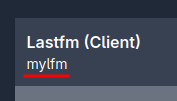
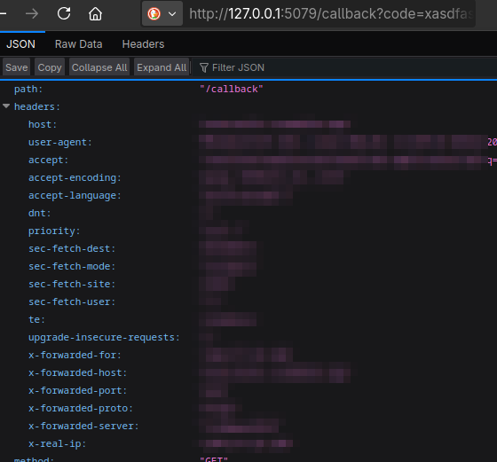

import Tabs from '@theme/Tabs';
import TabItem from '@theme/TabItem';
import CodeBlock from '@theme/CodeBlock';
import SchemaLink from "../../src/components/SchemaLink";
import AIOExample from "../../src/components/AIOExample";
import FileExample from "../../src/components/FileExample";
import ScrobbleThreshold from "@site/src/components/snippets/_scrobble-threshold.mdx"

import AIOConfig from '!!raw-loader!../../../config/config.json.example';
import AzuracastConfig from '!!raw-loader!../../../config/azuracast.json.example';
import ChromecastConfig from '!!raw-loader!../../../config/chromecast.json.example';
import DeezerConfig from '!!raw-loader!../../../config/deezer.json.example';
import DeezerDeprecatedConfig from '!!raw-loader!../../../config/deezer-deprecated.json.example';
import IcecastConfig from '!!raw-loader!../../../config/icecast.json.example';
import JellyfinConfig from '!!raw-loader!../../../config/jellyfin.json.example';
import JriverfinConfig from '!!raw-loader!../../../config/jriver.json.example';
import KodiConfig from '!!raw-loader!../../../config/kodi.json.example';
import KoitoConfig from '!!raw-loader!../../../config/koito.json.example';
import LastfmConfig from '!!raw-loader!../../../config/lastfm.json.example';
import LastfmEndpointConfig from '!!raw-loader!../../../config/endpointlfm.json.example';
import ListenbrainzConfig from '!!raw-loader!../../../config/listenbrainz.json.example';
import ListenbrainzEndpointConfig from '!!raw-loader!../../../config/endpointlz.json.example';
import MalojaConfig from '!!raw-loader!../../../config/maloja.json.example';
import MopidyConfig from '!!raw-loader!../../../config/mopidy.json.example';
import MprisConfig from '!!raw-loader!../../../config/mpris.json.example';
import MusikcubeConfig from '!!raw-loader!../../../config/musikcube.json.example';
import MusiccastConfig from '!!raw-loader!../../../config/musiccast.json.example';
import MPDConfig from '!!raw-loader!../../../config/mpd.json.example';
import PlexConfig from '!!raw-loader!../../../config/plex.json.example';
import PlexWebhookConfig from '!!raw-loader!../../../config/plex.webhook.json.example';
import SpotifyConfig from '!!raw-loader!../../../config/spotify.json.example';
import SubsonicConfig from '!!raw-loader!../../../config/subsonic.json.example';
import TautulliConfig from '!!raw-loader!../../../config/tautulli.json.example';
import WebscrobblerConfig from '!!raw-loader!../../../config/webscrobbler.json.example';
import YTMusicConfig from '!!raw-loader!../../../config/ytmusic.json.example';
import VLCConfig from '!!raw-loader!../../../config/vlc.json.example';

# Configuration

:::tip

Check the [**FAQ**](../FAQ.md) if you have any issues after configuration!

:::

## Configuration Types

[**Sources** and **Clients**](/#how-does-multi-scrobbler-ms-work) are configured using:

* environmental (ENV) variables
* client/source specific json config files
* an all-in-one json config file

**MS will parse configuration from all configuration types.** You can mix and match configurations but it is generally better to stick to one or the other.

<Tabs groupId="configType" queryString>
    <TabItem value="env" label="ENV">
        This is done by passing environmental variables and so does not require any files to run MS.

        * Using a docker container EX `docker run -e "SPOTIFY_CLIENT_ID=yourId" -e "SPOTIFY_CLIENT_SECRET=yourSecret" ...`
        * Using a local installations by exporting variables before running MS EX `SPOTIFY_CLIENT_ID=yourId SPOTIFY_CLIENT_SECRET=yourSecret node index.js`

        Use ENV-based configuration if:

        * You are the only person for whom MS is scrobbling for
        * You have a very simple setup for MS such as one scrobble [Client](/#client) and one [Source](/#source) IE Plex -> Maloja
    </TabItem>
    <TabItem value="file" label="File">
        MS will parse configuration files located in the directory specified by the `CONFIG_DIR` environmental variable. This variable defaults to:

        * Local installation -> `PROJECT_DIR/config`
        * Docker -> `/config` (in the container) -- see the [install docs](../installation/installation.mdx#docker) for how to configure this correctly

        <details>

            <summary>Use File-based configuration if...</summary>

            * You have many [Sources](/#source)
            * You have many of each type of **Source** you want to scrobble from IE 2x Plex accounts, 3x Spotify accounts, 1x
            Funkwhale...
            * You have more than one scrobble **Client** you want to scrobble to IE multiple Maloja servers
            * You want only some **Sources** to scrobble to some **Clients** IE Fred's Spotify account scrobbles to Fred's Maloja
            server, but not Mary's Maloja server

        </details>

        :::tip
            * There are **example configurations** for all Source/Client types and AIO config located in the [`/config`](https://github.com/FoxxMD/multi-scrobbler/tree/master/config) directory of this project. These can be used as-is by renaming them to `.json`.
            * For docker/flatpak installations these examples are copied to your configuration directory on first-time use.
            * There is also a [**kitchensink example**](kitchensink.md) that provides examples of using all sources/clients in a complex configuration.
        :::

        Each file is named by the **type** of the Client/Source found in below sections. Each file as an **array** of that type of Client/Source.

        Example directory structure:

        ```
        /CONFIG_DIR
            plex.json
            spotify.json
            maloja.json
        ```

        <details>
            <summary>Config Example</summary>

            <CodeBlock title="CONFIG_DIR/spotify.json" language="json5">{SpotifyConfig}</CodeBlock>

        </details>
    </TabItem>
    <TabItem value="aio" label="File AIO">
        MS will parse an **all-in-one** configuration file located in the directory specified by the `CONFIG_DIR` environmental variable. This variable defaults to:

        * Local installation -> `PROJECT_DIR/config/config.json`
        * Docker -> `/config/config.json` (in the container) -- see the [install docs](../installation/installation.mdx#docker) for how to configure this correctly

        <details>

            <summary>Use AIO-based configuration if...</summary>

            * You have many [Sources](/#source)
            * You have many of each type of **Source** you want to scrobble from IE 2x Plex accounts, 3x Spotify accounts, 1x
            Funkwhale...
            * You have more than one scrobble **Client** you want to scrobble to IE multiple Maloja servers
            * You want only some **Sources** to scrobble to some **Clients** IE Fred's Spotify account scrobbles to Fred's Maloja
            server, but not Mary's Maloja server

        </details>

        **The AIO config also enables setting default options for sources/clients as well as global options for MS itself.**

        :::tip
            * An example AIO config files can be found in the project directory at [`/config/config.json.example`](https://github.com/FoxxMD/multi-scrobbler/tree/master/config/config.json.example)
            * For docker/flatpak installations this example is copied to your configuration directory on first-time use.
            * There is also a [**kitchensink example**](kitchensink.md) that provides examples of using all sources/clients in a complex configuration.
        :::

        [**Explore the schema for this configuration, along with an example generator and validator, here**](https://json-schema.app/view/%23?url=https%3A%2F%2Fraw.githubusercontent.com%2FFoxxMD%2Fmulti-scrobbler%2Fmaster%2Fsrc%2Fbackend%2Fcommon%2Fschema%2Faio.json)

        <details>

            <summary>Config Example</summary>

            <CodeBlock title="CONFIG_DIR/config.json" language="json5">{AIOConfig}</CodeBlock>

        </details>
    </TabItem>
</Tabs>

## Application Options

These options affect multi-scrobbler's behavior and are not specific to any source/client.

#### Base URL

Defines the URL that is used to generate default redirect URLs for authentication on [spotify](#spotify) and [lastfm](#lastfm) -- as well as some logging hints.

* Default => `http://localhost:9078`
* Set with [ENV](./?configType=env#configuration-types) `BASE_URL` or `baseUrl` [all-in-one configuration](./?configType=aio#configuration-types)
* If protocol is `http` or no protocol is specified MS will try to use port `9078` -- to override this explicitly set the port or use `https`

Useful when running with [docker](../installation/installation.mdx#docker) so that you do not need to specify redirect URLs for each configuration.

<details>

    <summary>Example</summary>

    EX Lastfm Redirect Url is `BASE_URL:PORT/lastfm/callback` (when no other redirectUri is specified for [lastfm configuration](#lastfm))

    | `BASE_URL`                          | Redirect URL                                             |
    |-------------------------------------|----------------------------------------------------------|
    | `192.168.0.101`                     | `http://192.168.0.101:9078/lastfm/callback`              |
    | `http://my.domain.local`            | `http://my.domain.local:9078/lastfm/callback`            |
    | `http://192.168.0.101/my/subfolder` | `http://192.168.0.101:9078/my/subfolder/lastfm/callback` |

    | `BASE_URL`                        | Redirect URL                                             |
    |-----------------------------------|----------------------------------------------------------|
    | `my.domain.local:80`              | `http://192.168.0.101:80/lastfm/callback`                |
    | `my.domain.local:9000`            | `http://my.domain.local:9000/lastfm/callback`            |
    | `192.168.0.101:4000/my/subfolder` | `http://192.168.0.101:4000/my/subfolder/lastfm/callback` |
    | `https://192.168.0.101`           | `https://192.168.0.101:443/lastfm/callback`              |

</details>

#### Caching

Multi-scrobbler can cache some of its data for the purpose of **persisting queued and dead scrobbles** after restarting.

It supports caching using either:

* **File** cache stored in the `CONFIG_DIR` directory (next to your File/[AIO](./?configType=aio#configuration-types) file)
* [**Valkey**](https://valkey.io/), an open-source fork of Redis.

**File** caching is **enabled by default** when no other configuration is present.

The type of cache used, and it's connection properties, can be configured through ENV or **AIO** config.

##### Caching Configuration

<Tabs groupId="cache" queryString>

<TabItem value="file" label="File">

**File** cache is stored in the `CONFIG_DIR` directory using the pre-defined file name `ms-scrobble.cache`.

It is **enabled by default** if `CACHE_SCROBBLE`, or the respective AIO configuration, is not defined.

<Tabs groupId="configType" queryString>

<TabItem value="env" label="ENV">

| Environmental Variable | Required? | Default              | Description                                                  |
| :--------------------- | --------- | -------------------- | ------------------------------------------------------------ |
| `CACHE_SCROBBLE`       | No        | `file`               | The cache type to use                                        |
| `CACHE_SCROBBLE_CONN`  | No        | The config directory | The directory, within the container, to store the cache file |

</TabItem>

<TabItem value="aio" label="AIO">

```json5 title="config.json"
{
    "cache": {
        "scrobble": {
            "provider": "file",
            "connection": "/config"
        }
    },
    // ...
}
```

</TabItem>

</Tabs>
</TabItem>

<TabItem value="valkey" label="Valkey">

<Tabs groupId="configType" queryString>

<TabItem value="env" label="ENV">

| Environmental Variable | Required? | Default              | Description                                                  |
| :--------------------- | --------- | -------------------- | ------------------------------------------------------------ |
| `CACHE_SCROBBLE`       | Yes        | `valkey`               | The cache type to use                                      |
| `CACHE_SCROBBLE_CONN`  | Yes        |  | The host/IP and port to connect to, prefixed with `redis://` -- EX: `redis://192.168.0.120:6379` |

</TabItem>

<TabItem value="aio" label="AIO">

```json5 title="config.json"
{
    "cache": {
        "scrobble": {
            "provider": "valkey",
            "connection": "redis://192.168.0.120:6379"
        }
    },
    // ...
}
```

</TabItem>

</Tabs>
</TabItem>

</Tabs>

#### Debug Mode

Turning on Debug Mode will

* override and enable all optional "debugging" options found in configuration
* set log output to DEBUG

Use this as a shortcut for enabling output that can be used for troubleshooting and issue reporting. Be aware that logs will likely be VERY noisy while Debug Mode is on. You should only have this mode on while gathering logs for troubleshooting and then turn it off afterwards.

To set debug mode either add it to [AIO `config.json`](./?configType=aio#configuration-types)

```json5 title="config.json"
{
    "debugMode": true,
    "sources": [...],
    // ...
}
```

or set the ENV `DEBUG_MODE=true`

#### Disable Web

If you do not need the dashboard and/or ingress sources, or have security concerns about ingress and cannot control your hosting environment, the web server and API can be disabled.

:::warning

Any **ingress-based sources will be unusable** (Tautulli, Webscrobbler, etc...) if this is disabled.

:::

Disable using either:

* ENV `DISABLE_WEB=true`
* In [All-in-One File](./?configType=aio#configuration-types) use the top-level property `"disableWeb": true`

## Common Source Functionality

Some options and functionality is shared between all or some Sources. Detailed below is information on what these features are and how to use/configured them.

### Limiting Scrobble Destination

By default a Source will scrobble to **all** configured Clients.

To limit which Clients a Source will scrobble to use the `clients` property in a Source's [File/AIO configuration](./?configType=file#configuration-types) to specify the **names** of the Clients that it should scrobble to:

```json5 title="jellyfin.json"
{
    "name": "MyJellyfin",
    "clients": ["myMaloja","koitoA","listenbrainzFoo"]
    "data": {
        // ...
    },
}
```

The Source above will only scrobble to Clients that are **named** (`name` property in Client config) either `myMaloja` `koitoA` or `listenbrainzFoo`.

If your Client is configured using [ENV](./?configType=env#configuration-types) then they are given an automatically generated name. Check the multi-scrobbler Dashboard to find their name in a subheader under the Client type. Example:



<h3 id="scrobble-thresholds">Scrobble Thresholds</h3>

<ScrobbleThreshold filename="spotify"/>

These can also be configured **globally** for all Sources using ENVs:

```
SOURCE_SCROBBLE_DURATION=40
SOURCE_SCROBBLE_PERCENT=20
```

<h3 id="should-scrobble-behavior">Should Scrobble Behavior</h3>

:::note

This feature is currently available only for some Sources. Check each Source's documentation to see if it supported.

:::

For _most_ Sources multi-scrobbler can determine if a user is listening and scrobble automatically. For Sources which multi-scrobbler cannot do this or require additional configuration, a user can indicate to MS that it should or should not scrobble. This action can be taken on the Web Dashboard by clicking the link next to **Should Scrobble** found in each Source's status card.

Additionally, for these Sources, the default behavior for Scrobbling can be explicitly set by adding the following value to a Source's `options` in [file or aio config](./?configType=file#configuration-types):

```json5 title="azuracast.json"
{
    "data": {
        // ...
    },
    "options": {
        // set to true to always scrobble automatically
        // set to false to never scrobble automatically
        "systemScrobble": true
    }
}
```

## Source Configurations

### [Azuracast](https://www.azuracast.com/)

:::tip[Scrobbling Threshold]

Azuracast may not correctly report track length or position. If this is the case you should reduce the "listened to" **duration** using [Scrobble Thresholds](#scrobble-thresholds) so that multi-scrobbler scrobbles correctly.

:::

The Azuracast server should have **Use High-Performance Now Playing Updates** enabled in _Administration -> System Settings_

##### URL

The URL used by MS to connect to Azuracast has the syntax:

```
[ws|wss]://HOST:[PORT]
```

MS will automatically add the path required for websockets, [`/api/live/nowplaying/websocket`](https://www.azuracast.com/docs/developers/now-playing-data/#websockets), to your URL if none is provided. If you use a reverse proxy with a path-based URL or otherwise need a custom path to access the websockets path correctly then explicitly provide it. Examples:

```
URL From Config                => MS Uses

'ws://192.168.0.101'                 => ws://192.168.0.101/api/live/nowplaying/websocket
'ws://azura.mydomain.com'            => ws://azura.mydomain.com.com/api/live/nowplaying/websocket
'wss://mydomain.com/custom/azura/ws' => wss://mydomain.com/custom/azura/ws
```

##### Scrobble Behavior

Multi-scrobbler will set the default [**scrobbling behavior**](#should-scrobble-behavior) based on if either of these settings is configured:

* live status (`AZURA_LIVE` or `monitorWhenLive`) or
* listener count (`AZURA_LISTENERS_NUM` or `monitorWhenListeners`)

If either is configured then MS will automatically scrobble based on when these conditions are met.

If neither is configured automatic scrobble defaults to **off** and you should either [manually initiate it or explicitly set the default behavior.](#should-scrobble-behavior)

#### Configuration

<Tabs groupId="configType" queryString>
    <TabItem value="env" label="ENV">
        | Environmental Variable | Required? | Default | Description                                                                                    |
        | :--------------------- | :-------- | :------ | ---------------------------------------------------------------------------------------------- |
        | `AZ_URL`               | Yes       |         | Azuracast URL *without station name*                                                           |
        | `AZ_STATION`           | Yes       |         | The station name shown on the public page                                                      |
        | `AZURA_LIVE`           | No        | Yes     | Only scrobble when station status is ONLINE                                                    |
        | `AZURA_LISTENERS_NUM`  | No        | `true`  | Only scrobble if station has any listeners (`true`) or listeners are equal-to/greater-than `X` |
    </TabItem>
    <TabItem value="file" label="File">
        <details>

            <summary>Example</summary>

            <CodeBlock title="CONFIG_DIR/azuracast.json" language="json5">{AzuracastConfig}</CodeBlock>

        </details>

        or <SchemaLink lower objectName="AzuracastSourceConfig"/>
    </TabItem>
    <TabItem value="aio" label="AIO">
        <details>

            <summary>Example</summary>

            <AIOExample data={AzuracastConfig} name="azuracast"/>

        </details>

        or <SchemaLink lower objectName="AzuracastSourceConfig"/>                                                
    </TabItem>
</Tabs>

### [Deezer](https://deezer.com/)

<Tabs groupId="deezerSource" queryString>
    <TabItem value="arl" label="Unofficial ARL">
        :::warning

        This Source uses unofficial methods to access Deezer data that are likely in violation of Deezer's TOS. Deezer may change or remove these methods at any time, breaking functionality. Use this Source at your own risk.

        :::

        :::info

        This Source will work only if you have a **Premium** Deezer account.

        :::

        ##### Retrieve ARL

        The `arl` is a browser cookie that Deezer uses to store your login information. Multi-scrobbler uses the `arl` value to make authorized requests to Deezer's API where it can retrieve listening history.

        **After logging into Deezer**, use one of the methods below to retrieve the `arl` cookie value:

        <Tabs groupId="arlRetrival">
            <TabItem value="chrome" label="Chrome">
                1. On deezer.com, press F12 to open the Developer Tools window.
                2. Go to the Applications tab. Press the '>>' More tabs icon if it's hidden.
                3. Under the Cookies Filter, click deezer.com, then the text bar name `arl`.
                4. Copy all the contents shown in the **Cookie Value** pane.
            </TabItem>
            <TabItem value="firefox" label="Firefox">
                1. On deezer.com, hit Ctrl+Shift+I to open Developer Tools
                2. Go to the Storage Tab, then expand Cookies in the sidebar and select deezer.com
                3. Find the row with `arl` as the name, then double click the Value column and right click -> copy the value
            </TabItem>
        </Tabs>

        #### Configuration

        <Tabs groupId="configType" queryString>
            <TabItem value="env" label="ENV">
                | Environmental Variable | Required? | Default | Description                                      |
                | :--------------------- | --------- | ------- | ------------------------------------------------ |
                | `DEEZER_ARL`           | Yes       |         | The ARL cookie value retrieved from your browser |
            </TabItem>
            <TabItem value="file" label="File">
                <details>

                    <summary>Example</summary>

                    <CodeBlock title="CONFIG_DIR/deezer.json" language="json5">{DeezerConfig}</CodeBlock>

                </details>

                or <SchemaLink lower objectName="DeezerSourceConfig"/>
            </TabItem>
            <TabItem value="aio" label="AIO">
                <details>

                    <summary>Example</summary>

                    <AIOExample data={DeezerConfig} name="deezer"/>

                </details>

                or <SchemaLink lower objectName="DeezerSourceConfig"/>
            </TabItem>
        </Tabs>


        ##### Duplicate detection

        Third party integrations with Deezer (Sonos) may cause Deezer to [report the same track many times in listening history.](https://github.com/FoxxMD/multi-scrobbler/pull/296#issuecomment-2922374738) If you experience this issue modify your Deezer Source config (file-based only) to include the option `"fuzzyDiscoveryIgnore": "aggressive"`

        <details>

            <summary>deezer.json example</summary>

            ```json title="deezer.json"
            [
                {
                    "name": "MyDeezer",
                    "data": {
                        "arl": "UOsRPjT3U5Dhaaup3x...",
                    },
                    "options": {
                        "fuzzyDiscoveryIgnore": "aggressive"
                    }
                }
            ]
            ```
        </details>

        This option comes with some trade-offs: MS will aggressively detect repeated tracks within a window of time that should eliminate all duplicates. However, this will also prevent *intentionally* repeated tracks from being scrobbled. See [this thread](https://github.com/FoxxMD/multi-scrobbler/pull/296#issuecomment-2970417070) for more information on how this works.

    </TabItem>
    <TabItem value="official" label="Official API">

        :::warning

        **This Source is DEPRECATED because Deezer has dropped official API support.** This Source will **not** be removed but no further support or fixes will be given. [See this issue for more discussion.](https://github.com/FoxxMD/multi-scrobbler/issues/175#issuecomment-2296776625)

        Users cannot create new applications on Deezer Developers and there is no guarantee existing applications will continue to work.

        As a workaround consider:
        
        * Using the alternative [Deezer Source that uses unofficial, internal API via ARL](./?deezerSource=arl#deezer)
        * Connect Deezer with Last.fm and then use [Last.fm as a Source](#lastfm-source)

        :::

        Create a new application at [Deezer Developers](https://developers.deezer.com/myapps)

        * Application Domain must be the same as your multi-scrobbler domain. Default is `localhost:9078`
        * Redirect URL must end in `deezer/callback`
        * Default would be `http://localhost:9078/deezer/callback`

        After application creation you should have credentials displayed in the "My Apps" dashboard. You will need:

        * **Application ID**
        * **Secret Key**
        * **Redirect URL** (if not the default)

        **If no access token is provided...**

        After starting multi-scrobbler with credentials in-place open the dashboard (`http://localhost:9078`) and find your Deezer source. Click **(Re)authenticate and (re)start polling** to start the login process. After login is complete polling will begin automatically.

        #### Configuration

        <Tabs groupId="configType" queryString>
            <TabItem value="env" label="ENV">
                | Environmental Variable | Required? | Default                                 | Description                       |
                |------------------------|-----------|-----------------------------------------|-----------------------------------|
                | `DEEZER_CLIENT_ID`     | Yes       |                                         | Your **Application ID**           |
                | `DEEZER_CLIENT_SECRET` | Yes       |                                         | Your **Secret Key**               |
                | `DEEZER_REDIRECT_URI`  | No        | `http://localhost:9078/deezer/callback` | URI must end in `deezer/callback` |
            </TabItem>
            <TabItem value="file" label="File">
                <details>

                    <summary>Example</summary>

                    <CodeBlock title="CONFIG_DIR/deezer.json" language="json5">{DeezerDeprecatedConfig}</CodeBlock>

                </details>

                or <SchemaLink lower objectName="DeezerSourceConfig"/>
            </TabItem>
            <TabItem value="aio" label="AIO">
                <details>

                    <summary>Example</summary>

                    <AIOExample data={DeezerDeprecatedConfig} name="deezer"/>

                </details>

                or <SchemaLink lower objectName="DeezerSourceConfig"/>
            </TabItem>
        </Tabs>

        </TabItem>
</Tabs>

### [Google Cast (Chromecast)](https://www.google.com/chromecast/built-in/)

If your media device can be **Cast** to using this button  on your phone/computer then multi-scrobbler can monitor it in order to scrobble music you play.


:::note 

Google Cast support is **experimental**. You may experience crashes and errors while using this Source. Please open an issue if you experience problems and include all information detailed in the issue template to help debug your issue.

:::

:::note 

This source relies on common, **basic** music data provided by the cast device which will always be less exhaustive than data parsed from full source integrations. If there is an existing [Source](#source-configurations) it is recommended to configure for it and blacklist the app on Google Cast, rather than relying solely on Google Cast for scrobbling.

:::

#### Configuration

<Tabs groupId="configType" queryString>
    <TabItem value="env" label="ENV">
        :::note
        [Manually configuring cast device connections](#connecting-devices) is only available through file-based config.
        :::

        | Environmental Variable | Required? | Default |                                     Description                                      |
        |------------------------|-----------|---------|--------------------------------------------------------------------------------------|
        | CC_ENABLE              | No        |         | Set to 'true' to enable Cast monitoring without needing to define other ENVs         |
        | CC_WHITELIST_DEVICES   | No        |         | Only scrobble from these Cast devices. Comma-delimited list. EX mini-home, family-tv |
        | CC_BLACKLIST_DEVICES   | No        |         | Do not scrobble from these Cast devices. Comma-delimited list                        |
        | CC_WHITELIST_APPS      | No        |         | Only scrobble from these casted Apps. Comma-delimited list. EX spotify, pandora      |
        | CC_BLACKLIST_APPS      | No        |         | Do not scrobble from these casted Apps. Comma-delimited list                         |
    </TabItem>
    <TabItem value="file" label="File">

        <details>

            <summary>Example</summary>

            <CodeBlock title="CONFIG_DIR/chromecast.json" language="json5">{ChromecastConfig}</CodeBlock>

        </details>

        or <SchemaLink lower objectName="ChromecastSourceConfig"/>
    </TabItem>
    <TabItem value="aio" label="AIO">
        <details>

            <summary>Example</summary>

            <AIOExample data={ChromecastConfig} name="chromecast"/>

        </details>

        or <SchemaLink lower objectName="ChromecastSourceConfig"/>
    </TabItem>
</Tabs>

#### Connecting Devices

Cast devices can be manually configured using file-based configuration OR automatically discovered using **mDNS.**

###### mDNS Discovery

The host machine running multi-scrobbler must be configured to allow [mDNS traffic on port 5353/UDP](https://book.hacktricks.xyz/network-services-pentesting/5353-udp-multicast-dns-mdns).

<details>

    <summary>OS Specific Instructions</summary>

<Tabs>
    <TabItem value="linux" label="Linux">
        **Docker**

        The host machine must have [avahi-daemon](https://avahi.org/) running to circumvent limitations with DNS resolution due to musl in Alpine. Most major linux distributions package avahi and many have it built-in. Once avahi is running you must pass D-Bus and the avahi daemon socket to your container like so:

        ```
        docker run ... -v /var/run/dbus:/var/run/dbus -v  	/var/run/avahi-daemon/socket:/var/run/avahi-daemon/socket ... foxxmd/multi-scrobbler
        ```

        **Flatpak/Nodejs**

        No additional steps are required.
    </TabItem>
    <TabItem value="windows" label="Windows">
        **Docker**

        Unsupported at this time.

        **Nodejs**

        No additional steps are required.
    </TabItem>
</Tabs>

</details>

#### What Media Does MS Scrobble?

Cast devices report what type of media the current activity is [(see `metadata` property here)](https://developers.google.com/cast/docs/media/messages#MediaInformation). The reported type is dependent on the application playing the media to correctly report it, the cast device does not magically know what the media is. If an application does not report a type it is always classified as `unknown`.

**By default, MS will only track media that is reported as `MusicTrack`.**

##### Allow Unknown Media Type

Media with an Unknown (`Generic`) media type can be explicitly allowed by setting `"allowUnknownMedia": true` in the file-based configuration. This can also be configured to only allow unknown media types for specific applications by using a list of application names.

<details>

    <summary>Example</summary>

    ```json5 title="chromecast.json"
    [
      {
        "name": "MyCast",
        "type": "chromecast",
        "data": {
          // only allow unknown if app name contains any of these phrases
          "allowUnknownMedia": ["smarttube", "default media receiver"]
        },
      }
    ]
    ```

</details>

##### Forcing Media Tracking

MS can be forced to track media from an application regardless of media type. This is useful if an application incorrectly reports a media type you are sure should be music. Set `"forceMediaRecognitionOn"` in the file-based configuration to a list of application names that should always be tracked.

<details>

    <summary>Example</summary>

    ```json5 title="chromecast.json"
    [
      {
        "name": "MyCast",
        "type": "chromecast",
        "data": {
          // media from applications that contains these phrases will always be tracked, regardless of media type reported
          "forceMediaRecognitionOn": ["smarttube", "default media receiver"]
        },
      }
    ]
    ```

</details>

#### Cast Troubleshooting

Please include any/all logs with raw output if there are any errors encountered as this is critical to diagnosing issues.

To diagnose bad/incomplete track information or strange MS player behavior please turn on **payload logging** and include log output of the source running to help diagnose this issue. Either enable in config using the below example OR enable [Debug Mode.](#debug-mode)

<details>

    <summary>Example</summary>

    ```json5 title="chromecast.json"
    [
      {
        "name": "MyCast",
        "type": "chromecast",
        "data": {
          //...
        },
        "options": {
          "logPayload": true
        }
      }
    ]
    ```

</details>

### [Icecast](https://icecast.org)

Parse metadata from any Icecast Station (streams) to use for scrobbling.

:::note

There is no standard format for presenting track information in an Icecast stream and the majority of streams that do include metadata only use a single string (`StreamTitle`) from which metadata can be parsed.

Multi-scrobbler will do its best to parse Artist/Album/Track information from this data but the quality and consistency for this is solely based on how the Icecast broadcaster chooses to format their tracks.

:::

:::tip[Scrobbling Behavior]

Multi-scrobbler cannot automatically determine if you are listening to a Station. Therefore, **automatic scrobbling for Icecast Sources is off by default.**

Use [Should Scrobble Behavior](#should-scrobble-behavior) to initiate scrobbling or configure automatic scrobble.

:::

:::tip[Scrobbling Threshold]

Icecast does not report track lengths so multi-scrobbler cannot determine if it should scrobble based on percent played. You should instead set a shorter "listened to" **duration** using [Scrobble Thresholds.](#scrobble-thresholds)

:::


##### URL and Sources

The URL should be the URL you would use to stream audio. 

Additional sources are supported based on those found in [`icecast-metadata-stats`](https://github.com/eshaz/icecast-metadata-js/tree/main/src/icecast-metadata-stats#supported-status-apis). To use these with automatic parsing [based on the regular URL](https://github.com/eshaz/icecast-metadata-js/tree/main/src/icecast-metadata-stats#options) include a `sources` array in your config the same way as shown in `icecast-metadata-stats`:

<details>

    <summary>Example</summary>

```json5 title="config.json"
[
    {
      "name": "myIcy",
      "enable": true,
      "data": {
        "url": "http://myIcecast.com/radio",
        "sources": ["icy", "ogg", "sevenhtml"]
      }
    }
  ]
  
```
</details>

To manually set these sources include the same [`*Endpoint` options](https://github.com/eshaz/icecast-metadata-js/tree/main/src/icecast-metadata-stats#options) found in `icecast-metadata-stats`.

If no `sources` are configured for multi-scrobbler it will automatically try to use `icy` and `ogg`.

#### Configuration

<Tabs groupId="configType" queryString>
    <TabItem value="env" label="ENV">
        | Environmental Variable | Required? | Default | Description |
        | :--------------------- | :-------- | :------ | ----------- |
        | `ICECAST_URL`          | Yes       |         | Icecast URL |
    </TabItem>
    <TabItem value="file" label="File">
        <details>

            <summary>Example</summary>

            <CodeBlock title="CONFIG_DIR/icecast.json" language="json5">{IcecastConfig}</CodeBlock>

        </details>

        or <SchemaLink lower objectName="IcecastSourceConfig"/>
    </TabItem>
    <TabItem value="aio" label="AIO">
        <details>

            <summary>Example</summary>

            <AIOExample data={IcecastConfig} name="icecast"/>

        </details>

        or <SchemaLink lower objectName="IcecastSourceConfig"/>                                                
    </TabItem>
</Tabs>

### [Jellyfin](https://jellyfin.org/)

:::warning[Webhook Method Deprecated]

In multi-scrobbler **below v0.8.4** communication with Jellyfin was done using Jellyfin's **Webhook** plugin. This has been deprecated in favor of directly using Jeyllfin's API for a better experience in multi-scrobbler.

Webhook functionality will be removed in an upcoming release of MS. If you are still using the Webhook method you should migrate to the API method as soon as possible.

:::

<details>

    <summary>Migrating from Webhook (multi-scrobbler below `v0.8.4`) to API</summary>

    * Remove the Jellyfin **Webhook** plugin (if not using it for anything else)
    * Follow the new instructions below (outside this section) to setup API usage
    * The `servers` (`JELLYFIN_SERVERS`) setting is no longer available as MS only scrobbles from the server using the API anyways.
      * If you need to scrobble for multiple servers set up each server as a separate Jellyfin source
    * The `users` (`JELLYFIN_USER`) setting has been renamed `usersAllow` (`JELLYFIN_USERS_ALLOWED`)
      * If you were using this filter to ensure only scrobbles from yourself were registered then you no longer need this setting -- by default MS will only scrobble for the user authenticated with Jellyfin's API.

</details>

Must be using Jellyfin 10.7 or greater

* Create an **API Key** for multi-scrobbler
  * In the Jellyfin desktop web UI Navigate to -> Administration -> Dashboard -> API Keys (`http://YOUR_JELLYIN_URL/web/index.html#!/apikeys.html`)
  * Click `+` button and create a new key with **App name** `multi-scrobbler`
  * Copy the created API Key value for use in configuration below


It is **recommended** to use API Key + username but if you are not an admin for your Jellyfin instance you can also authenticate with your Jellyfin username and **password.**

:::tip[Important Defaults]

By default...

* multi-scrobbler will **only** scrobble for the user authenticated with the API. 
  * Allowed Users (`usersAllow` or `JELLYFIN_USERS_ALLOW`) are only necessary if you want to scrobble for additional users.
* multi-scrobbler will **only** scrobble media found in Jellyfin libraries that were labelled as **Music.**
  * `librariesAllow` or `JELLYFIN_LIBRARIES_ALLOW` will override this
  * OR use `additionalAllowedLibraryTypes` to allow more types (like `mixed` or `book` for audiobooks)
* multi-scrobbler will **only** scrobble media Jellyfin detects as **Audio.**
  * To force multi-scrobbler to scrobble when media is detected as **Unknown** use `"allowUnknown": true` in file/aio configuration.

:::

#### Configuration

<Tabs groupId="configType" queryString>
    <TabItem value="env" label="ENV">
        | Environmental Variable     | Required? | Default | Description                                                                                |
        | -------------------------- | --------- | ------- | ------------------------------------------------------------------------------------------ |
        | `JELLYFIN_URL`             | **Yes**   |         | The URL of the Jellyfin server IE `http://localhost:8096`                                  |
        | `JELLYFIN_USER`            | **Yes**   |         | The user to authenticate with the API                                                      |
        | `JELLYFIN_APIKEY`          | No        |         | The API Key to use for authentication **(Must provide either apikey or password)**         |
        | `JELLYFIN_PASSWORD`        | No        |         | The password of the user to authenticate for. **(Must provide either apikey or password)** |
        | `JELLYFIN_USERS_ALLOW`     | No        |         | Comma-separated list of usernames (from Jellyfin) to scrobble for                          |
        | `JELLYFIN_USERS_BLOCK`     | No        |         | Comma-separated list of usernames (from Jellyfin) to disallow scrobble for                 |
        | `JELLYFIN_DEVICES_ALLOW`   | No        |         | Comma-separated list of devices to scrobble from                                           |
        | `JELLYFIN_DEVICES_BLOCK`   | No        |         | Comma-separated list of devices to disallow scrobbles from                                 |
        | `JELLYFIN_LIBRARIES_ALLOW` | No        |         | Comma-separated list of libraries to allow scrobbles from                                  |
        | `JELLYFIN_LIBRARIES_BLOCK` | No        |         | Comma-separated list of libraries to disallow scrobbles from                               |
    </TabItem>
    <TabItem value="file" label="File">
        <details>

            <summary>Example</summary>

            <CodeBlock title="CONFIG_DIR/jellyfin.json" language="json5">{JellyfinConfig}</CodeBlock>

        </details>

        or <SchemaLink lower objectName="JellyApiSourceConfig"/>

    </TabItem>
    <TabItem value="aio" label="AIO">
        <details>

            <summary>Example</summary>

            <AIOExample data={JellyfinConfig} name="jellyfin"/>

        </details>

        or <SchemaLink lower objectName="JellyApiSourceConfig"/>
    </TabItem>
</Tabs>

### [JRiver](https://jriver.com/)

In order for multi-scrobbler to communicate with JRiver you must have [Web Server Interface](https://wiki.jriver.com/index.php/Web_Service_Interface#Documentation_of_Functions) enabled. This can can be in the JRiver GUI:

* Tools -> Options -> Media Network
  * Check `Use Media Network to share this library...`
  * If you have `Authentication` checked you will need to provide the **Username** and **Password** in the ENV/File configuration below.

#### Configuration {#jriver-config}

<Tabs groupId="configType" queryString>
    <TabItem value="env" label="ENV">
        | Environmental Variable | Required |             Default             |                  Description                   |
        |------------------------|----------|---------------------------------|------------------------------------------------|
        | JRIVER_URL             | Yes      | http://localhost:52199/MCWS/v1/ | The URL of the JRiver server                   |
        | JRIVER_USERNAME        | No       |                                 | If authentication is enabled, the username set |
        | JRIVER_PASSWORD        | No       |                                 | If authenticated is enabled, the password set  |
    </TabItem>
    <TabItem value="file" label="File">
        <details>

            <summary>Example</summary>

            <CodeBlock title="CONFIG_DIR/jriver.json" language="json5">{JriverfinConfig}</CodeBlock>

        </details>

        or <SchemaLink lower objectName="JRiverSourceConfig"/>
    </TabItem>
    <TabItem value="aio" label="AIO">
        <details>

            <summary>Example</summary>

            <AIOExample data={JriverfinConfig} name="jriver"/>

        </details>

        or <SchemaLink lower objectName="JRiverSourceConfig"/>
    </TabItem>
</Tabs>

##### URL

The URL used to connect to JRiver, set in your [file config as `url`.](#jriver-config) The URL used to connect ultimately must be formed like this:

```
Syntax  => [protocol]://[hostname]:[port]/[path]
Default =>       http://localhost:52199/MCWS/v1/
```

If any part of this URL is missing multi-scrobbler will use a default value. This also means that if any part of your URL is **not** standard you must explicitly define it.

:::tip[Jriver Settings]

* Make sure the port number matches what is found in `Advanced` section in the [Media Network](#jriver) options.
* If your installation is on the same machine but you cannot connect using `localhost` try `0.0.0.0` instead.

:::

<details>
    <summary>URL Transform Examples</summary>

    Examples of a given `url` in your file config and the final URL multi-scrobbler will use to connect to JRiver:

    | `url`                                    | Transformed URL                             |
    |------------------------------------------|---------------------------------------------|
    | (none set)                               | `http://localhost:52199/MCWS/v1/`           |
    | `jriver.mydomain.com`                    | `http://jriver.mydomain.com:52199/MCWS/v1/` |
    | `192.168.0.101:3456`                     | `http://192.168.0.101:3456/MCWS/v1/`        |
    | `mydomain.com:80/jriverReverse/MCWS/v1/` | `mydomain.com:80/jriverReverse/MCWS/v1/`    |

</details>

### [Kodi](https://kodi.tv/)

In order for multi-scrobbler to communicate with Kodi you must have the [Web Interface](https://kodi.wiki/view/Web_interface) enabled. This can be done in the Kodi GUI:

* Settings -> Services -> Control
  * Check `Allow remote control via HTTP`
  * Ensure you have a **Username** and **Password** set, you will need to provide them in the ENV/File configuration below.

#### Configuration {#kodi-config}

<Tabs groupId="configType" queryString>
    <TabItem value="env" label="ENV">
        | Environmental Variable | Required | Default                       | Description                |
        |------------------------|----------|-------------------------------|----------------------------|
        | KODI_URL               | Yes      | http://localhost:8080/jsonrpc | The URL of the Kodi server |
        | KODI_USERNAME          | No       |                               | The username set           |
        | KODI_PASSWORD          | No       |                               | The password set           |
    </TabItem>
    <TabItem value="file" label="File">
        <details>

            <summary>Example</summary>

            <CodeBlock title="CONFIG_DIR/kodi.json" language="json5">{KodiConfig}</CodeBlock>

        </details>

        or <SchemaLink lower objectName="KodiSourceConfig"/>
    </TabItem>
    <TabItem value="aio" label="AIO">
        <details>

            <summary>Example</summary>

            <AIOExample data={KodiConfig} name="kodi"/>

        </details>

        or <SchemaLink lower objectName="KodiSourceConfig"/>
    </TabItem>
</Tabs>

##### URL

The URL used to connect to Kodi, set in your [file config as `url`.](#kodi-config) The URL used to connect ultimately must be formed like this:

```
Syntax  => [protocol]://[hostname]:[port]/[path]
Default =>       http://localhost:8080/jsonrpc
```

If any part of this URL is missing multi-scrobbler will use a default value. This also means that if any part of your URL is **not** standard you must explicitly define it.

:::tip[Kodi Settings]

* Make sure the port number matches what is found in **Port** in the [Control](#kodi) section mentioned above.
* If your installation is on the same machine but you cannot connect using `localhost` try `0.0.0.0` instead.

:::

<details>
    <summary>URL Transform Examples</summary>

    Examples of a given `url` in your file config and the final URL multi-scrobbler will use to connect to Kodi:

    | `url`                                 | Transformed URL                              |
    |---------------------------------------|----------------------------------------------|
    | (none set)                            | `http://localhost:8080/jsonrpc`              |
    | `kodi.mydomain.com`                   | `http://kodi.mydomain.com:8080/jsonrpc`      |
    | `192.168.0.101:3456`                  | `http://192.168.0.101:3456/jsonprc`          |
    | `mydomain.com:80/kodiReverse/jsonrpc` | `http://mydomain.com:80/kodiReverse/jsonrpc` |

</details>

### [Koito (Source)](https://koito.io/)

This Source monitors a Koito account's scrobble history and then re-scrobbles discovered tracks to configured [Clients.](#client-configurations)

:::tip[Other Uses]

To  _scrobble to_ a Koito server, create a [Koito (Client)](#koito)

:::

See the [Koito (Client)](#koito) configuration for general setup. The only difference for **Source** configuration:

* Cannot be setup with ENV config 
* [File/AIO config](./?configType=file#configuration-types) must include `"configureAs": "source"`

#### Configuration

<Tabs groupId="configType" queryString>
    <TabItem value="env" label="ENV">
        :::note
            You cannot use ENV variables shown in the [Koito Client config](#koito) -- multi-scrobbler assumes Koito ENVs are always used for the **client** configuration. You must use the [File or AIO](./?configType=file#configuration-types) config to setup Koito as a Source.
        :::
    </TabItem>
    <TabItem value="file" label="File">
        <details>
            Change `configureAs` to `source`

            <summary>Example</summary>

            <FileExample title="CONFIG_DIR/koito.json" data={KoitoConfig}/>

        </details>

        or <SchemaLink lower objectName="KoitoSourceConfig"/>
    </TabItem>
    <TabItem value="aio" label="AIO">
        <details>
            Change `configureAs` to `source`

            <summary>Example</summary>

            <AIOExample data={KoitoConfig} name="koito"/>

        </details>

        or <SchemaLink lower objectName="KoitoSourceConfig"/>
    </TabItem>
</Tabs>

### [Last.fm (Source)](https://www.last.fm)

This Source **monitors your Last.fm scrobble history** and re-scrobbles new activity to configured [Clients.](#client-configurations)

:::tip[Other Uses]

* To **scrobble to** Last.fm, create a [Last.fm (Client)](#lastfm)
* To accept scrobbles from outside applications as if multi-scrobbler was Last.fm, create a [Last.fm (Endpoint)](#lastfm-endpoint)

:::

To configure this Source use the same registration instructions and configuration data shown in [Last.fm (Client)](#lastfm) with the difference being `"configureAs": "source"` defined in the File/AIO configuration below.

#### Configuration

<Tabs groupId="configType" queryString>
    <TabItem value="env" label="ENV">
        No support for ENV based for Last.fm as a client (only source)
    </TabItem>
    <TabItem value="file" label="File">
        <details>
            Change `configureAs` to `source`

            <summary>Example</summary>

            <FileExample title="CONFIG_DIR/lastfm.json" data={LastfmConfig}/>

        </details>

        or <SchemaLink lower objectName="LastfmSourceConfig"/>
       </TabItem>
    <TabItem value="aio" label="AIO">
        <details>
            Change `configureAs` to `source`

            <summary>Example</summary>

            <AIOExample data={LastfmConfig} name="lastfm"/>

        </details>

        or <SchemaLink lower objectName="LastfmSourceConfig"/>
    </TabItem>
</Tabs>

### [Last.fm (Endpoint)](https://www.last.fm)

This Source enables multi-scrobbler to accept scrobbles from outside applications as if it was a Last.fm server.

:::tip[Other Uses]

* To **scrobble to** Last.fm, create a [Last.fm (Client)](#lastfm)
* To monitor and re-scrobble activity from your Last.fm account, create a [Last.fm (Source)](#lastfm-source)

:::

##### URL

If a **slug** is **not** provided in configuration then multi-scrobbler will accept Last.fm scrobbles at

```
http://localhost:9078/2.0/
```

which is the "standard" Last.fm server path for scrobbling

Use a slug only if you need to setup multiple Last.fm Endpoint sources and cannot use different tokens.

If a slug is used then the URL will be:

```
http://localhost:9078/api/lastfm/mySlug
```

#### Configuration

<Tabs groupId="configType" queryString>
    <TabItem value="env" label="ENV">
        | Environmental Variable | Required? | Default | Description                                                                                                        |
        | :--------------------- | :-------- | ------- | ------------------------------------------------------------------------------------------------------------------ |
        | `LFMENDPOINT_ENABLE`   | No        |         | Use LFM Endpoint as a Source without any other configuration. Only required if slug/token are not provided as ENVs |
        | `LFM_SLUG`             | No        |         | (Optional) The URL suffix to use for accepting LFM scrobbles                                                       |
    </TabItem>
    <TabItem value="file" label="File">
        <details>
            Change `configureAs` to `source`

            <summary>Example</summary>

            <CodeBlock title="CONFIG_DIR/endpointlfm.json" language="json5">{LastfmEndpointConfig}</CodeBlock>

        </details>

        or <SchemaLink lower objectName="LastFMEndpointSourceConfig"/>
    </TabItem>
    <TabItem value="aio" label="AIO">
        <details>
            Change `configureAs` to `source`

            <summary>Example</summary>

            <AIOExample data={LastfmEndpointConfig} name="endpointlfm"/>

        </details>

        or <SchemaLink lower objectName="LastFMEndpointSourceConfig"/>
    </TabItem>
</Tabs>

### [Listenbrainz (Source)](https://listenbrainz.org)

This Source monitors a Listenbrainz account's scrobble history and then re-scrobbles discovered tracks to configured clients.

:::tip[Other Uses]

* To **scrobble to** a Listenbrainz server, create a [Listenbrainz (Client)](#listenbrainz)
* To accept scrobbles from outside applications as if multi-scrobbler was a Listenbrainz server, create a [Listenbrainz (Endpoint)](#listenbrainz-endpoint)

:::

You will need to run your own Listenbrainz server or have an account [on the official instance](https://listenbrainz.org/login/).

On your [profile page](https://listenbrainz.org/profile/) find your **User Token** to use in the configuration.

#### Configuration

<Tabs groupId="configType" queryString>
    <TabItem value="env" label="ENV">
        :::note
            You cannot use ENV variables shown in the [Listenbrainz Client config](#listenbrainz) -- multi-scrobbler assumes Listenbrainz ENVs are always used for the **client** configuration. You must use the **File** or AOI config to setup Listenbrainz as a Source.
        :::
    </TabItem>
    <TabItem value="file" label="File">
        <details>
            Change `configureAs` to `source`

            <summary>Example</summary>

            <FileExample title="CONFIG_DIR/listenbrainz.json" data={ListenbrainzConfig}/>

        </details>

        or <SchemaLink lower objectName="ListenBrainzSourceConfig"/>
    </TabItem>
    <TabItem value="aio" label="AIO">
        <details>
            Change `configureAs` to `source`

            <summary>Example</summary>

            <AIOExample data={ListenbrainzConfig} name="listenbrainz"/>

        </details>

        or <SchemaLink lower objectName="ListenBrainzSourceConfig"/>
    </TabItem>
</Tabs>

### [Listenbrainz (Endpoint)](https://listenbrainz.org)

This Source enables multi-scrobbler to accept scrobbles from outside applications as if it was a Listenbrainz server. An example of this would be configuring [pano-scrobbler](https://github.com/kawaiiDango/pano-scrobbler) with a custom Listenbrainz URL to point to multi-scrobbler.

:::tip[Other Uses]

* To **scrobble to** a Listenbrainz server, create a [Listenbrainz (Client)](#listenbrainz)
* To monitor and re-scrobble activity from a Listenbrainz account, create a [Listenbrainz (Source)](#listenbrainz-source)

:::

##### URL

If a **slug** is **not** provided in configuration then multi-scrobbler will accept Listenbrainz scrobbles at

```
http://localhost:9078/1/submit-listens
```

which is the "standard" Listenbrainz server path for scrobbling.

Use a slug only if you need to setup multiple Listenbrainz Endpoint sources and cannot use different tokens.

If a slug is used then the URL will be:

```
http://localhost:9078/api/listenbrainz/mySlug
```

:::note
    Some Listenbrainz applications may require custom Listenbrainz URLs to be a real domain (`example.com`) and/or use SSL (`https://`). In this case you should setup multi-scrobbler behind a reverse proxy to support this functionality. It is out of the scope of this project to do this solely within multi-scrobbler.
:::

##### Token

Most Listenbrainz clients require a token (Authentication Token) to be provided during setup. This value can be anything you want, just make sure to use the same value for `token` in your multi-scrobbler configuration for the endpoint.


#### Configuration

<Tabs groupId="configType" queryString>
    <TabItem value="env" label="ENV">
        | Environmental Variable | Required? | Default | Description                                                                                                       |
        | :--------------------- | :-------- | ------- | ----------------------------------------------------------------------------------------------------------------- |
        | `LZENDPOINT_ENABLE`    | No        |         | Use LZ Endpoint as a Source without any other configuration. Only required if slug/token are not provided as ENVs |
        | `LZE_TOKEN`            | No        |         | LZ "Authentication Token" you provided to the scrobbling application                                              |
        | `LZE_SLUG`             | No        |         | (Optional) The URL suffix to use for accepting LZ scrobbles                                                       |
    </TabItem>
    <TabItem value="file" label="File">
        <details>
            Change `configureAs` to `source`

            <summary>Example</summary>

            <CodeBlock title="CONFIG_DIR/endpointlz.json" language="json5">{ListenbrainzEndpointConfig}</CodeBlock>

        </details>

        or <SchemaLink lower objectName="ListenbrainzEndpointSourceConfig"/>
    </TabItem>
    <TabItem value="aio" label="AIO">
        <details>
            Change `configureAs` to `source`

            <summary>Example</summary>

            <AIOExample data={ListenbrainzEndpointConfig} name="endpointlz"/>

        </details>

        or <SchemaLink lower objectName="ListenbrainzEndpointSourceConfig"/>
    </TabItem>
</Tabs>

### [Maloja (Source)](https://github.com/krateng/maloja)

This Source monitors a Maloja server's scrobble history and then re-scrobbles discovered tracks to configured [Clients.](#client-configurations)

:::tip[Other Uses]

To  _scrobble to_ a Maloja server, create a [Maloja (Client)](#maloja)

:::

See the [Maloja (Client)](#maloja) configuration for general setup. The only difference for **Source** configuration:

* Cannot be setup with ENV config 
* [File/AIO config](./?configType=file#configuration-types) must include `"configureAs": "source"`

#### Configuration

<Tabs groupId="configType" queryString>
    <TabItem value="env" label="ENV">
        :::note
            You cannot use ENV variables shown in the [Maloja Client config](#maloja) -- multi-scrobbler assumes Maloja ENVs are always used for the **client** configuration. You must use the [File or AIO](./?configType=file#configuration-types) config to setup Maloja as a Source.
        :::
    </TabItem>
    <TabItem value="file" label="File">
        <details>
            Change `configureAs` to `source`

            <summary>Example</summary>

            <FileExample title="CONFIG_DIR/maloja.json" data={MalojaConfig}/>

        </details>

        or <SchemaLink lower objectName="MalojaSourceConfig"/>
    </TabItem>
    <TabItem value="aio" label="AIO">
        <details>
            Change `configureAs` to `source`

            <summary>Example</summary>

            <AIOExample data={MalojaConfig} name="maloja"/>

        </details>

        or <SchemaLink lower objectName="MalojaSourceConfig"/>
    </TabItem>
</Tabs>

### [Mopidy](https://mopidy.com/)

Mopidy is a headless music server that supports playing music from many [standard and non-standard sources such as Pandora, Bandcamp, and Tunein.](https://mopidy.com/ext/)

multi-scrobbler can scrobble tracks played from any Mopidy backend source, regardless of where you listen to them.

:::note

You must have [Mopidy-HTTP extension](https://mopidy.com/ext/http) enabled for this integration to work.

:::

#### Configuration {#mopidy-config}

<Tabs groupId="configType" queryString>
    <TabItem value="env" label="ENV">
        No ENV support
    </TabItem>
    <TabItem value="file" label="File">
        <details>

            <summary>Example</summary>

            <CodeBlock title="CONFIG_DIR/mopidy.json" language="json5">{MopidyConfig}</CodeBlock>

        </details>

        or <SchemaLink lower objectName="MopidySourceConfig"/>
    </TabItem>
    <TabItem value="aio" label="AIO">
        <details>

            <summary>Example</summary>

            <AIOExample data={MopidyConfig} name="mopidy"/>

        </details>

        or <SchemaLink lower objectName="MopidySourceConfig"/>
    </TabItem>
</Tabs>

#### Configuration Options

###### URL

The URL used to connect to the Mopidy server, set in your [file config as `url`.](#mopidy-config) The URL used to connect ultimately must be formed like this:

```
Syntax  => [protocol]://[hostname]:[port]/[path]
Default =>         ws://localhost:6680/mopidy/ws
```

If any part of this URL is missing multi-scrobbler will use a default value. This also means that if any part of your URL is **not** standard you must explicitly define it.

:::tip[Mopidy Configuration]

Make sure the hostname and port number match what is found in the Mopidy configuration file `mopidy.conf`:

```ini
[http]
hostname = localhost
port = 6680
```

:::

<details>
<summary>URL Transform Examples</summary>

    Examples of a given `url` in your file config and the final URL multi-scrobbler will use to connect to Mopidy:

    | `url`                          | Transformed URL                            |
    |--------------------------------|--------------------------------------------|
    | (none set)                     | `ws://localhost:6680/mopidy/ws`            |
    | `mopidy.mydomain.com`          | `ws://mopidy.mydomain.com:6680/mopidy/ws/` |
    | `192.168.0.101:3456`           | `ws://192.168.0.101:3456/mopidy/ws/`       |
    | `mopidy.mydomain.com:80/MOPWS` | `ws://mopidy.mydomain.com:80/MOPWS`        |

</details>


##### URI Blacklist/Whitelist

If you wish to disallow or only allow scrobbling from some sources played through Mopidy you can specify these using `uriBlacklist` or `uriWhitelist` in your config. multi-scrobbler will check the list to see if any string matches the START of the `uri` on a track. If whitelist is used then blacklist is ignored. All strings are case-insensitive.

<details>
    <summary>Example</summary>
    ```json
    {
        "uriBlacklist": ["soundcloud"]
    }
    ```

    Will prevent multi-scrobbler from scrobbling any Mopidy track that start with a `uri` like `soundcloud:song:MySong-1234`
</details>


##### Album Blacklist

For certain sources (Soundcloud) Mopidy does not have all track info (Album) and will instead use "Soundcloud" as the Album name. You can prevent multi-scrobbler from using this bad Album data by adding the fake Album name to this list. Multi-scrobbler will still scrobble the track, just without the bad data. All strings are case-insensitive.

<details>
    <summary>Example</summary>
    ```json
    {
        "albumBlacklist": ["SoundCloud", "Mixcloud"]
    }
    ```

    If a track would be scrobbled like
    ```
    Album: Soundcloud, Track: My Cool Track, Artist: A Cool Artist
    ```
    then multi-scrobbler will instead scrobble
    ```
    Track: My Cool Track, Artist: A Cool Artist
    ```
</details>

### [MPD (Music Player Daemon)](https://www.musicpd.org/)

MS communicates with MPD using the [TCP client connection.](https://mpd.readthedocs.io/en/stable/user.html#client-connections)

You should uncomment/create the following settings in your mpd config:

```
bind_to_address	"any"   # or a specific ipv4/v6 address
port            "6600"
```

<!-- MS will also discover MPD servers if [zeroconf support](https://mpd.readthedocs.io/en/stable/user.html#zeroconf) is enabled and MS is set up to utilize mDNS. This can be disabled in file-config options. -->

#### Configuration

<Tabs groupId="configType" queryString>
    <TabItem value="env" label="ENV">
        | Environmental Variable | Required? | Default          | Description |
        |------------------------|-----------|------------------|-------------|
        | `MPD_URL`              | No        | `localhost:6600` |             |
        | `MPD_PASSWORD`         | No        |                  |             |
    </TabItem>
    <TabItem value="file" label="File">
        <details>

            <summary>Example</summary>

            <CodeBlock title="CONFIG_DIR/mpd.json" language="json5">{MPDConfig}</CodeBlock>

        </details>

        or <SchemaLink lower objectName="MPDSourceConfig"/>
    </TabItem>
    <TabItem value="aio" label="AIO">
        <details>

            <summary>Example</summary>

            <AIOExample data={MPDConfig} name="mpd"/>

        </details>

        or <SchemaLink lower objectName="MPDSourceConfig"/>
    </TabItem>
</Tabs>

### [MPRIS](https://specifications.freedesktop.org/mpris-spec/latest/)

MPRIS is a standard interface for communicating with Music Players on **linux operating systems.**

If you run Linux and have a notification tray that shows what media you are listening to, you likely have access to MPRIS.


multi-scrobbler can listen to this interface and scrobble tracks played by **any media player** that communicates to the operating system with MPRIS.

##### Host Setup

MPRIS communication requires multi-scrobbler to have access to the host's dbus-daemon.

<Tabs groupId="dbus" queryString>
    <TabItem value="local" label="Local">
        If multi-scrobbler is running as a [**Local Installation**](../installation/installation.mdx#nodejs), directly with node/npm, on the same host as MPRIS then no setup is required.

        Remote setup is also possible, see the **Remote Unix Socket** section in the Docker tab.
    </TabItem>
    <TabItem value="docker" label="Docker">
        If multi-scrobbler is running as a [**Docker Container**](../installation/installation.mdx#docker) some modifications are required...

        ##### Local Unix Socket

        The most secure way is to **run a multi-scrobbler container on the same host as MPRIS.** In this scenario you can simply mount the **user session** dbus unix socket into the container. Make sure [`PUID` and `PGID` ENVs are configured](../installation/#linux-host) so the container has permissions to access the socket. Then, modify your compose stack with these additional values:

        ```yaml title="docker-compose.yaml"

            environment:
            - DBUS_SESSION_BUS_ADDRESS=unix:path=/run/user/UID/bus 

            volumes:
            - /run/user/UID/bus:/run/user/UID/bus:ro
        ```

        ##### Remote Unix Socket

        :::warning

        This method is **insecure.** You should not expose dbus over a network unless access to the port is restricted and the network is trusted.

        :::

        Use [`socat`](https://linux.die.net/man/1/socat) to bidirectionally relay communication from the host's dbus socket to a listening TCP port.

        To make dbus for user with uid `1000` available on port `6644`:

        ```shell
        socat TCP-LISTEN:6644,reuseaddr,fork UNIX-CONNECT:/run/user/1000/bus
        ```

        Then, add the following value to multi-scrobbler's ENVs:

        ```
        DBUS_SESSION_BUS_ADDRESS=tcp:host=yourHostIP,port=6644
        ```

    </TabItem>
</Tabs>

#### Configuration

<Tabs groupId="configType" queryString>
    <TabItem value="env" label="ENV">
        | Environmental Variable | Required? | Default | Description                                                                      |
        |------------------------|-----------|---------|----------------------------------------------------------------------------------|
        | MPRIS_ENABLE           | No        |         | Use MPRIS as a Source (useful when you don't need any other options)             |
        | MPRIS_BLACKLIST        | No        |         | Comma-delimited list of player names not to scrobble from                        |
        | MPRIS_WHITELIST        | No        |         | Comma-delimited list of players names to ONLY scrobble from. Overrides blacklist |
    </TabItem>
    <TabItem value="file" label="File">
        <details>

            <summary>Example</summary>

            <CodeBlock title="CONFIG_DIR/mpris.json" language="json5">{MprisConfig}</CodeBlock>

        </details>

        or <SchemaLink lower objectName="MPRISSourceConfig"/>
    </TabItem>
    <TabItem value="aio" label="AIO">
        <details>

            <summary>Example</summary>

            <AIOExample data={MprisConfig} name="mpris"/>

        </details>

        or <SchemaLink lower objectName="MPRISSourceConfig"/>
    </TabItem>
</Tabs>

### [Musikcube](https://musikcube.com)

In order to use Musikcube configure it to accept [websocket connections](https://github.com/clangen/musikcube/wiki/remote-api-documentation) in **server setup**:

* Enable the **Metadata Server**
* Set a **Password**

Both of these settings are found in _Musikcube -> (s)ettings -> server setup_


The URL used by MS has the syntax:

```
[ws|wss]://HOST:[PORT]
```

The **port** is the same as shown in the server setup screenshot from above, under **metadata server enabled**. If no port is provided to MS it will default to `7905`.

If no URL is provided to MS it will try to use `ws://localhost:7905`

#### Configuration

<Tabs groupId="configType" queryString>
    <TabItem value="env" label="ENV">
        | Environmental Variable | Required? | Default               | Description                          |
        |------------------------|-----------|-----------------------|--------------------------------------|
        | `MC_URL`               | No        | `ws://localhost:7905` | Use port set for **metadata server** |
        | `MC_PASSWORD`          | Yes       |                       |                                      |
    </TabItem>
    <TabItem value="file" label="File">
        <details>

            <summary>Example</summary>

            <CodeBlock title="CONFIG_DIR/musikcube.json" language="json5">{MusikcubeConfig}</CodeBlock>

        </details>

        or <SchemaLink lower objectName="MusikcubeSourceConfig"/>
    </TabItem>
    <TabItem value="aio" label="AIO">
        <details>

            <summary>Example</summary>

            <AIOExample data={MusikcubeConfig} name="musikcube"/>

        </details>

        or <SchemaLink lower objectName="MusikcubeSourceConfig"/>
    </TabItem>
</Tabs>

### [Plex](https://plex.tv)

<Tabs groupId="plexType" queryString>
<TabItem value="api" label="API">

Find your [**Plex Token**](https://support.plex.tv/articles/204059436-finding-an-authentication-token-x-plex-token/) and make note of the **URL** and **Port** used to connect to your Plex instance.

<details>

<summary>Allowed Users and Defaults</summary>

**Multi-scrobbler will automatically scrobble for these users by default:**

* The User authenticated with the Plex Token
* and the **Local User**

The Local User (`PLEX_LOCAL_USER`) is how Plex identifies anyone directly accessing the Plex UI from a local IP (who does not need to login).

To allow MS to scrobble for other users use `usersAllow` or `PLEX_USERS_ALLOW` (env) from the below configuration docs. However, because you are overriding the default settings you must also explicitly list the authenticated user and the Local User if you want them to also be able to scrobble.

<details>

<summary>Examples</summary>

###### Defaults

If `usersallow` and `PLEX_USERS_ALLOW` are not defined then the Plex Token authenticated User and Local User will be scrobbled for.


###### Only A Specific User

* `"usersallow": ["SomeUser"]` or
* `PLEX_USERS_ALLOW: SomeUser`

Only the Plex user `SomeUser` will be scrobbled for. The Plex Token authenticated user and the Local User will not be scrobbled for.

###### A Specific User + Defaults

(Assuming the plex authenticated user is `FoxxMD`)

* `"usersallow": ["FoxxMD", "PLEX_LOCAL_USER", "SomeUser"]` or
* `PLEX_USERS_ALLOW: FoxxMD,PLEX_LOCAL_USER,SomeUser`

The Plex user SomeUser, the Plex Token authenticated user (FoxxMD) and the Local User will be scrobbled for.

</details>

</details>

<details>

<summary>Allowed Libraries and Defaults</summary>

By default multi-scrobbler will only scrobble media found in Plex libraries that are labelled as **Music.**
  * `librariesAllow` or `PLEX_LIBRARIES_ALLOW` will override this

</details>

#### Configuration

<Tabs groupId="configType" queryString>
    <TabItem value="env" label="ENV">
        | Environmental Variable | Required? | Default | Description                                                            |
        | ---------------------- | --------- | ------- | ---------------------------------------------------------------------- |
        | `PLEX_URL`             | **Yes**   |         | The URL of the Plex server IE `http://localhost:32400`                 |
        | `PLEX_TOKEN`           | **Yes**   |         | The **Plex Token** to use with the API                                 |
        | `PLEX_USERS_ALLOW`     | No        |         | Comma-separated list of usernames (from Plex) to scrobble for          |
        | `PLEX_USERS_BLOCK`     | No        |         | Comma-separated list of usernames (from Plex) to disallow scrobble for |
        | `PLEX_DEVICES_ALLOW`   | No        |         | Comma-separated list of devices to scrobble from                       |
        | `PLEX_DEVICES_BLOCK`   | No        |         | Comma-separated list of devices to disallow scrobbles from             |
        | `PLEX_LIBRARIES_ALLOW` | No        |         | Comma-separated list of libraries to allow scrobbles from              |
        | `PLEX_LIBRARIES_BLOCK` | No        |         | Comma-separated list of libraries to disallow scrobbles from           |
    </TabItem>
    <TabItem value="file" label="File">
        <details>

            <summary>Example</summary>

            <CodeBlock title="CONFIG_DIR/plex.json" language="json5">{PlexConfig}</CodeBlock>

        </details>

        or <SchemaLink lower objectName="PlexApiSourceConfig"/>

    </TabItem>
    <TabItem value="aio" label="AIO">
        <details>

            <summary>Example</summary>

            <AIOExample data={PlexConfig} name="plex"/>

        </details>

        or <SchemaLink lower objectName="PlexApiSourceConfig"/>
    </TabItem>
</Tabs>

</TabItem>
<TabItem value="webhook" label="Webhook (Deprecated)">

:::warning[Deprecated]

Multi-scrobbler < 0.8.7 used [webhooks](https://support.plex.tv/articles/115002267687-webhooks) to support Plex scrobbling. This approach has been deprecated in favor of using Plex's API directly which has many benefits including **not requiring Plex Pass.**

The Plex Webhook Source will be removed in an upcoming release. You should migrate to the API source as soon as possible.

:::

<details>

    <summary>Migrating to API</summary>

    * Follow the instructions in the API tab
    * The `user` (`PLEX_USER`) setting has been renamed `usersAllow` (`PLEX_USERS_ALLOW`)
      * If you were using this filter to ensure only scrobbles from yourself were registered then you no longer need this setting -- by default MS will only scrobble for the user the Plex Token is from.
    * The `servers` setting is no longer available as MS only scrobbles from the server the Plex token is from.
      * If you need to scrobble for multiple servers set up each server as a separate Plex API source with a separate token.
    * The `libraries` setting has been renamed to `librariesAllow`

</details>

* In the Plex dashboard Navigate to your **Account/Settings** and find the **Webhooks** page
* Click **Add Webhook**
* URL -- `http://localhost:9078/plex` (substitute your domain if different than the default)
* **Save Changes**

##### Configuration

<Tabs groupId="configType" queryString>
    <TabItem value="env" label="ENV">
        | Environmental Variable | Required | Default | Description                                                                                                                             |
        |------------------------|----------|---------|-----------------------------------------------------------------------------------------------------------------------------------------|
        | `PLEX_USER`            | No       |         | The a comma-delimited list of usernames to scrobble tracks for. No usernames specified means all tracks by all users will be scrobbled. |
    </TabItem>
    <TabItem value="file" label="File">

        <details>

            <summary>Example</summary>

            <CodeBlock title="CONFIG_DIR/plex.json" language="json5">{PlexWebhookConfig}</CodeBlock>

        </details>

        or <SchemaLink lower objectName="PlexSourceConfig"/>
    </TabItem>
    <TabItem value="aio" label="AIO">
        <details>

            <summary>Example</summary>

            <AIOExample data={PlexWebhookConfig} name="plex"/>

        </details>

        or <SchemaLink lower objectName="PlexSourceConfig"/>
    </TabItem>
</Tabs>

</TabItem>
</Tabs>

### [Spotify](https://www.spotify.com)

<details>

<summary>Spotify and Automix</summary>

If your Spotify player has [Automix](https://community.spotify.com/t5/FAQs/What-is-Automix/ta-p/5257278) enabled and Spotify uses it for your playlist/queue then MS cannot accurately determine when a track will end. This is because the track is "mixed" in your queue with a shorter play time than its actual length and [Spotify does not report this modified play time in its API.](https://community.spotify.com/t5/Spotify-for-Developers/Wrong-duration-ms-of-track-with-Automix/m-p/5429147) This **does not affect MS's ability to scrobble** from Spotify but it will affect the accuracy of the duration MS reports was played.

</details>

#### Authenticate Spotify with Multi-Scrobbler

To access your Spotify history you must [create a Spotify App](https://developer.spotify.com/dashboard) to get a
Client ID/Secret.

1. **Login to https://developer.spotify.com** with your existing Spotify account and accept Developer Terms

2. Navigate to your Spotify Developer [Dashboard](https://developer.spotify.com/dashboard) and start the **Create App** process

3. Determine the correct **Redirect URI** to use and set it in your App settings

<details>

<summary>Redirect URI Instructions</summary>

A Redirect URI is the URL that Spotify will navigate your **browser** to after you complete authorization. The URL will contain the code necessary for multi-scrobbler to get a Spotify access token.

Spotify [**no longer allows insecure URIs**](https://developer.spotify.com/documentation/web-api/tutorials/migration-insecure-redirect-uri) (start with `http://`) unless the address is `127.0.0.1` -- so `localhost` and internal IPs (`192.168.0.xxx`) no longer work.

Use **one** of the following methods to specify a valid Redirect URI and complete Spotify authentication with multi-scrobbler:

<Tabs groupId="spotifyRedirect" queryString>
    <TabItem value="https" label="HTTPS">
        **Use a domain you control, with SSL certificates/HTTPS enabled, to create a valid redirect URI.**
        
        For example, if you are already running multi-scrobbler behind a reverse proxy (nginx/traefik/caddy) at `https://scrobbler.mydomain.com` then set the Spotify Redirect URI for your Spotify App, and multi-scrobbler `SPOTIFY_REDIRECT_URI` ENV, to `https://scrobbler.mydomain.com/callback`

        Alternatively, if multi-scrobbler is not accessible behind your domain, then use the [**Echo**](./?spotifyRedirect=echo#spotify) method with your own domain instead of 127.0.0.1.
    </TabItem>
    <TabItem value="local" label="Run MS Locally">
        **Run multi-scrobbler, configured for a Spotify Source, from the same machine as your browser in order to get credentials.**
        
        In this scenario you can use `http://127.0.0.1:9078/callback` as the Spotify Redirect URI and multi-scrobbler `SPOTIFY_REDIRECT_URI` ENV.
        
        After completing authentication, copy the contents of local multi-scrobbler's [configuration folder](../installation/installation.mdx#storage) to the final location of where multi-scrobbler will be run.
    </TabItem>
    <TabItem value="echo" label="Echo">
        **Use a docker container on the same machine your browser is on to "intercept" the callback URL from Spotify authentication, then manually finish the process by changing the domain to your multi-scrobbler instance.**


        1. Create a container on the same machine as your browser using the [`mendhak/http-https-echo:36`](https://github.com/mendhak/docker-http-https-echo) image. This container runs a simple HTTP server that echos back any request it recieves.

        ```shell
        docker run --rm -p 127.0.0.1:5079:8080 mendhak/http-https-echo:36
        ```

        2. Set the Spotify Redirect URI and multi-scrobbler `SPOTIFY_REDIRECT_URI` ENV as `http://127.0.0.1:5079/callback`

        3. In [Authenticate Spotify with Multi-Scrobbler](#authenticate-spotify-with-multi-scrobbler) (outside these Redirect Instructions) go to **Step 4** and continue the instructions

        Eventually, Spotify will redirect you to a web page with a URL like `http://127.0.0.1:5079/callback?code=xxxxxx...`

        

        4. In the URL, replace `127.0.0.1:5079` with the address/IP for your multi-scrobbler instance so the URL is similar to `http://192.168.0.101:9078/callback?code=xxxxxx...`. Then navigate to this URL to complete authentication.

    </TabItem>

    <TabItem value="msEcho" label="Echo from echo.multi-scrobbler.app">
        For your convenience, I run the [`mendhak/http-https-echo:36`](https://github.com/mendhak/docker-http-https-echo) container from the [**Echo**](./?spotifyRedirect=echo#spotify) approach on a domain I, the multi-scrobbler developer [FoxxMD](https://github.com/FoxxMD), control and self-host. Please be aware:
        
        * I **do not collect personal data** or any querystrings/data sent in requests to this site
        * It's **not possible** for me to use the code sent by Spotify to this URL without also having your Client ID/Secret
        * However, there is **always** risk involved with trusting a service you do not control. Evaluate the risk of using this site for yourself.

        Use the [**Echo**](./?spotifyRedirect=echo#spotify) approach, starting from **Step 2**, with **https://echo.multi-scrobbler.app/callback** as Spotify Redirect URI and multi-scrobbler `SPOTIFY_REDIRECT_URI` ENV.
    </TabItem>
</Tabs>

</details>

4. Save your new App, then copy the Client ID/Secret from the App's Basic Information page.

5. Add the Client ID, Secret, and Redirect URI to the respective field/ENV in the [configuration section below](#spotify-config)

6. Start multi-scrobbler, then visit the Web Dashboard and click **(Re)authenticate** on the Spotify card to start the auth process

#### Configuration {#spotify-config}

<Tabs groupId="configType" queryString>
<TabItem value="env" label="ENV">
    | Environmental Variable     | Required? | Default                          |                    Description                     |
    |----------------------------|-----------|----------------------------------|----------------------------------------------------|
    | `SPOTIFY_CLIENT_ID`        | Yes       |                                  |                                                    |
    | `SPOTIFY_CLIENT_SECRET`    | Yes       |                                  |                                                    |
    | `SPOTIFY_REDIRECT_URI`     | No         | `http://localhost:9078/callback` | URI must end in `callback`                         |
</TabItem>
<TabItem value="file" label="File">
    <details>

        <summary>Example</summary>

        <CodeBlock title="CONFIG_DIR/spotify.json" language="json5">{SpotifyConfig}</CodeBlock>

    </details>

    or <SchemaLink lower objectName="SpotifySourceConfig"/>
</TabItem>
<TabItem value="aio" label="AIO">
    <details>

        <summary>Example</summary>

        <AIOExample data={SpotifyConfig} name="spotify"/>

    </details>
    or <SchemaLink lower objectName="SpotifySourceConfig"/>
</TabItem>
</Tabs>

### [Subsonic](http://www.subsonic.org/)

Can use this source for any application that implements the [Subsonic API](http://www.subsonic.org/pages/api.jsp) and supports the [`getNowPlaying`](http://www.subsonic.org/pages/api.jsp#getNowPlaying) endpoint (such as [Airsonic](https://airsonic.github.io/) and [Navidrome](https://www.navidrome.org/))

:::warning[Known Issues]

* Multiple artists are reported as one value and cannot be separated
* If using [Airsonic Advanced](https://github.com/airsonic-advanced/airsonic-advanced) the password used (under **Credentials**) must be **Decodable**

:::

Use the optional `usersAllow` property with **File** or **AIO** configuration to restrict scrobbling to a list of defined users.

#### Configuration

<Tabs groupId="configType" queryString>
    <TabItem value="env" label="ENV">
        | Environmental Variable | Required? | Default | Description                          |
        |------------------------|-----------|---------|--------------------------------------|
        | `SUBSONIC_USER`        | Yes       |         |                                      |
        | `SUBSONIC_PASSWORD`    | Yes       |         |                                      |
        | `SUBSONIC_URL`         | Yes       |         | Base url of your subsonic-api server |
    </TabItem>
    <TabItem value="file" label="File">
        <details>

            <summary>Example</summary>

            <CodeBlock title="CONFIG_DIR/subsonic.json" language="json5">{SubsonicConfig}</CodeBlock>

        </details>

        or <SchemaLink lower objectName="SubSonicSourceConfig"/>
    </TabItem>
    <TabItem value="aio" label="AIO">
        <details>

            <summary>Example</summary>

            <AIOExample data={SubsonicConfig} name="subsonic"/>

        </details>

        or <SchemaLink lower objectName="SubSonicSourceConfig"/>
    </TabItem>
</Tabs>

### [Tautulli](https://tautulli.com)

:::warning[Deprecated]

Multi-scrobbler >= 0.8.8 supports a Plex Source that [directly uses the API](./?plexType=api#plex) and removes the need to use Tautulli since it does not require Plex Pass.

The Tautuilli Source will be removed in an upcoming release. You should migrate to the Plex API source as soon as possible.

:::

Check the [instructions](plex.md) on how to setup a notification agent.

#### Configuration

<Tabs groupId="configType" queryString>
    <TabItem value="env" label="ENV">
        | Environmental Variable | Required | Default | Description                                                                                                                             |
        |------------------------|----------|---------|-----------------------------------------------------------------------------------------------------------------------------------------|
        | `TAUTULLI_USER`        | No       |         | The a comma-delimited list of usernames to scrobble tracks for. No usernames specified means all tracks by all users will be scrobbled. |
    </TabItem>
    <TabItem value="file" label="File">

        <details>

            <summary>Example</summary>

            <CodeBlock title="CONFIG_DIR/tautulli.json" language="json5">{TautulliConfig}</CodeBlock>

        </details>

        or <SchemaLink lower objectName="TautulliSourceConfig"/>
    </TabItem>
    <TabItem value="aio" label="AIO">
        <details>

            <summary>Example</summary>

            <AIOExample data={TautulliConfig} name="tautulli"/>

        </details>

        or <SchemaLink lower objectName="TautulliSourceConfig"/>
    </TabItem>
</Tabs>

### [WebScrobbler](https://web-scrobbler.com/)

After installing the extension open the preferences/settings for it:

* Under **Accounts**
  * **Add Webhook**
    * API URL: `[YourMultiScrobblerInstance]/api/webscrobbler` EX `http://localhost:9078/api/webscrobbler`
    * Application name: `(whatever you want)`

Reload the extension after adding the webhook.

:::note

* **On Firefox** - Only FQNs (domain.tld), `localhost`, and `127.0.0.1` are supported for API URL due to [firefox requiring https](https://github.com/web-scrobbler/web-scrobbler/issues/4183#issuecomment-1749222006)
* **On Chromium-based Browsers** - Any domain will work for API URL
* All other browsers are untested

:::

:::warning

Multi-scrobbler is **not** designed to be publicly accessible from the internet. To use Webscrobbler outside your local network you should be accessing MS through a VPN or through a reverse proxy with some kind of authentication (though this is still not recommended).

:::

#### Configuration {#webscrobbler-config}

<Tabs groupId="configType" queryString>
    <TabItem value="env" label="ENV">
        | Environmental Variable | Required? | Default | Description                                                              |
        |------------------------|-----------|---------|--------------------------------------------------------------------------|
        | WS_ENABLE              | No        |         | Set to 'true' to enable WS without needing to define other ENVs          |
        | WS_WHITELIST           | No        |         | Only scrobble from these WebScrobbler Connectors. Comma-delimited list   |
        | WS_BLACKLIST           | No        |         | Do not scrobble from these WebScrobbler Connectors. Comma-delimited list |
    </TabItem>
    <TabItem value="file" label="File">
        <details>

            <summary>Example</summary>

            <CodeBlock title="CONFIG_DIR/webscrobbler.json" language="json5">{WebscrobblerConfig}</CodeBlock>

        </details>

        or <SchemaLink lower objectName="WebScrobblerSourceConfig"/>
    </TabItem>
    <TabItem value="aio" label="AIO">
        <details>

            <summary>Example</summary>

            <AIOExample data={WebscrobblerConfig} name="webscrobbler"/>

        </details>

        or <SchemaLink lower objectName="WebScrobblerSourceConfig"/>
    </TabItem>
</Tabs>

##### Multiple Users

If you would like use multiple WebScrobbler sources they can be matched using a **slug** at the end of the **API URL.** This requires using [a file-based config.](./?configType=file#webscrobbler-config)

<details>

    <summary>Example</summary>

    ```json title="webscrobbler.json"
    [
      {
        "name": "aUserWS",
        "clients": [
          "client1Maloja"
        ],
        "data": {
          "slug": "usera"
        }
      },
      {
        "name": "bUserWS",
        "clients": [
          "client2Maloja"
        ],
        "data": {
          "slug": "userb"
        }
      }
    ]
    ```

    * To use `aUserWS` source set **API URL** to `http://localhost:9078/api/webscrobbler/usera`
    * To use `bUserWS` source set **API URL** to `http://localhost:9078/api/webscrobbler/userb`

    :::tip

    `http://localhost:9078/api/webscrobbler` is matched with the first source that _that does not have a slug defined._

    :::

</details>

###### Connectors Black/Whitelist

MS can be configured to only scrobble, or NOT scrobble, from some WS connectors. Use the name of the website from the [supported websites](https://web-scrobbler.com/) or from the **Connectors** tab in the extension. 

:::note

This affects **only** MS's behavior and does not affect the general connector behavior you have configured within the WebScrobbler extension.

:::

### [VLC](https://www.videolan.org/vlc/)

MS communicates with VLC using the [Web (`http`) interface module](https://wiki.videolan.org/VLC_HTTP_requests/)

#### Enable HTTP Interface

Open VLC:

* **Tools** Menu -> Preferences
  * In the bottom left change **Show Settings** from `Simple` to `All`
  * In the updated window select `Interface -> Main interfaces`
     * In the **Extra interface modules** section enable **Web** and verify that `http` is shown in the textbox
  * Select `Interface -> Main interfaces -> Lua`
    * In Lua HTTP -> Password -> set a password in this box
  * Click **Save** at the bottom to persist your changes
* Restart VLC
* Verify the HTTP interface is accessible by navigating to `http://localhost:8080` in your browser

If the interface is accessible, after typing in your password, VLC  is now ready to be used by MS.

##### Setting VLC Interface and Port

These can be set by starting VLC from command line with specific options:

* `vlc --http-host yourHostIp:yourPort` or
* `vlc --http-port yourPort` or
* modify the configuration file for VLC by editing keys with the same values as from the command line (`http-host` and `http-port`)


#### Configuration

<Tabs groupId="configType" queryString>
    <TabItem value="env" label="ENV">
        | Environmental Variable | Required?  | Default          | Description |
        |------------------------|------------|------------------|-------------|
        | `VLC_URL`              | No         | `localhost:8080` |             |
        | `VLC_PASSWORD`         | Yes        |                  |             |
    </TabItem>
    <TabItem value="file" label="File">
        <details>

            <summary>Example</summary>

            <CodeBlock title="CONFIG_DIR/vlc.json" language="json5">{VLCConfig}</CodeBlock>

        </details>

        or <SchemaLink lower objectName="VLCSourceConfig"/>
    </TabItem>
    <TabItem value="aio" label="AIO">
        <details>

            <summary>Example</summary>

            <AIOExample data={VLCConfig} name="vlc"/>

        </details>

        or <SchemaLink lower objectName="VLCSourceConfig"/>
    </TabItem>
</Tabs>

#### Filename Parsing

If the file being played in VLC does not have ID3 tags/metadata information multi-scrobbler can attempt to extract artist, title, and album information from the raw filename using regular expressions. Mutli-scrobbler will only do this if there is **no other information** reported by VLC about these fields.

To extract this information use [named capture groups](https://developer.mozilla.org/en-US/docs/Web/JavaScript/Reference/Regular_expressions/Named_capturing_group) in your expression matching the field that should be extracted: `artist` `title` and/or `album`. MS accepts multiple expressions, the first one that matches a filename will be used.

Example usage in [a file-based config:](./?configType=file#webscrobbler-config)

```json5 title="config/vlc.json" {10-15}
[
  {
    "name": "MyVlc",
    "enable": true,
    "data": {
      // ...
    },
    "options": {
      "filenamePatterns": [
          // Extracts artist and title from filenames that look like:
          // My Artist - My Cool title.mp4
          "/^\\s*(?<artist>.+?) - (?<title>.+?)\\.\\w+$/i"
        ],
      // logs to DEBUG when MS tries to extract data from a filename
      "logFilenamePatterns": true,
    }
  }
]
```

#### Vlc Information Reporting

If you find that VLC is incorrectly reporting track information (in its interface) but multi-scrobbler is not parsing it correctly it may be due to the _name_ of the fields VLC is reporting. mutli-scrobbler uses the most common field name but does not cover all use cases. Before reporting an issue please turn on metadata logging and include output from your logs while it is turned on:

```json5 title="config/vlc.json" {9-9}
    [
      {
        "name": "MyVlc",
        "enable": true,
        "data": {
          // ...
        },
        "options": {
          "dumpVlcMetadata": true
        }
      }
    ]
```
  
### [Yamaha MusicCast](https://usa.yamaha.com/products/contents/audio_visual/musiccast/index.html)

Monitor Musiccast device/receivers for music played on Network/USB/CD inputs.

:::tip[Scrobbling Threshold]

Musiccast may not correctly report track length. If this is the case you should reduce the "listened to" **duration** using [Scrobble Thresholds](#scrobble-thresholds) so that multi-scrobbler scrobbles correctly.

:::

##### URL

If only a domain/IP:PORT is provided to multi-scrobbler it will automatically append the default Musiccast API path. If your Musiccast device is located behind a custom URL (or reverse proxy) you should explicitly provide the base path to use.

EX

    | `url`                                   | Transformed URL                                 |
    | --------------------------------------- | :---------------------------------------------- |
    | `http://192.168.0.101`                  | `http://192.168.0.101/YamahaExtendedControl/v1` |
    | `http://mydomain.com/reverseProxy/cast` | `http://mydomain.com/reverseProxy/cast`         |

#### Configuration

<Tabs groupId="configType" queryString>
    <TabItem value="env" label="ENV">
        or <SchemaLink lower objectName="AzuracastSourceConfig"/>
        | Environmental Variable | Required? | Default | Description              |
        | :--------------------- | :-------- | ------- | :----------------------- |
        | `MCAST_URL`            | Yes       |         | The Musiccast device URL |                                                    
    </TabItem>
    <TabItem value="file" label="File">
        <details>
            Change `configureAs` to `source`

            <summary>Example</summary>

            <CodeBlock title="CONFIG_DIR/musiccast.json" language="json5">{MusiccastConfig}</CodeBlock>

        </details>

        or <SchemaLink lower objectName="MusicCastSourceConfig"/>
    </TabItem>
    <TabItem value="aio" label="AIO">
        <details>
            Change `configureAs` to `source`

            <summary>Example</summary>

            <AIOExample data={MusiccastConfig} name="musiccast"/>

        </details>

        or <SchemaLink lower objectName="MusicCastSourceConfig"/>
    </TabItem>
</Tabs>

### [Youtube Music](https://music.youtube.com)

:::warning

Communication with YT Music is **unofficial** and not supported or endorsed by Google. This means that **this integration may stop working at any time** if Google decides to change how YT Music works in the browser.

:::

:::tip[Scrobble Troubleshooting]

Due to monitoring being unofficial, listening history from YTM can be inconsistent and can cause missed scrobbles. 

[**See the FAQ**](../FAQ.md#youtube-music-misses-or-duplicates-scrobbles) for a detailed explanation, how to see more details about MS's detection of tracks, and how to properly report an issue.

:::

#### Authentication {#ytm-auth}

Only one of these methods needs to be used.

<Tabs groupId="ytmAuth" queryString>
    <TabItem value="cookie" label="Cookies">

        Use instructions from 
        
        * https://github.com/patrickkfkan/Volumio-YouTube.js/wiki/How-to-obtain-Cookie or 
        * https://ytmusicapi.readthedocs.io/en/stable/setup/browser.html#copy-authentication-headers 
        
        to get the **Cookie** value from a browser.

        It is highly recommended to [get the cookie from an Incognito/Private Session](https://github.com/LuanRT/YouTube.js/issues/803#issuecomment-2504032666) to limit the chance the session is invalidated from normal browsing.

        Add the cookie to your `ytmusic.json` config in `data` or as an ENV: 

        ```json
            {
            "type": "ytmusic",
            "enable": true,
            "name": "MyYTM",
            "data": {
                "cookie": "__Secure-1PSIDTS=sidts-CjEB3EgAEvCd-......"
            },
            "options": {
                "logAuthUpdateChanges": true,
                "logDiff": true
            }
        }
        ```

        If MS gives you authentication errors (session invalidated) at some point in the future follow the same instructions to get new cookies.

    </TabItem>
    <TabItem value="oauth" label="OAuth Client">
        :::warning

        As of Sept 25' OAuth clients no longer seem to have permission to access the YTM service, as reported by the upstream YTM library developer and [several other users.](https://github.com/FoxxMD/multi-scrobbler/issues/345#issuecomment-3258518769)

        If you have existing, working OAuth credentials keep using them but there is no gaurantee they will continue to work.

        If you are setting up the YTM Source for the first time you should first try to use [Cookies](./?ytmAuth=cookie#ytm-auth).

        :::

        [Based on the instructions from here...](https://github.com/LuanRT/YouTube.js/issues/803#issuecomment-2479689924)

        * Login to [Google Cloud console](https://console.cloud.google.com/) (create an account, if necessary)
          * [Create a new project](https://console.cloud.google.com/projectcreate)
        * Go to APIs and services.
            * Configure the OAuth consent screen
                * Use the old experience if possible
                * If new is unavoidable then do not fill out any branding and under Authorized Domains you can delete the empty one (in order to save)
                * Add yourself as an authorized user
            * Navigate to Credentials
                * Create Credentials -> choose "OAuth client ID"
                    *  Application Type is **Web Application**
                    * **Name** is whatever you want, leave Authorization Javascript origins blank
                    * Authorized redirect URIs
                        * This must be **exactly** the same as what is displayed in MS! For now leave it blank so we can generate it from MS first
                * Create
                    * In the newly created client popup save the **Client ID** and **Client Secret**, then copy them into `ytmusic.json` or appropriate ENVs:

        ```json
        {
            "type": "ytmusic",
            "enable": true,
            "name": "MyYTM",
            "data": {
                "clientId": "8910....6jqupl.apps.googleusercontent.com",
                "clientSecret": "GOCSPX-WGXL6BSuQ343..."
            },
            "options": {
                "logAuthUpdateChanges": true,
                "logDiff": true
            }
        }
        ```

        Now, start MS and during the YTMusic startup it will log something like this:

        ```
        Will use custom OAuth Client:
        Client ID: ...
        Client Secret: ...
        Redirect URI: http://localhost:9078/api/ytmusic/callback?name=MyYTM
        ```

        If the beginning of the Redirect URI (before `api`) is EXACTLY how you would reach the MS dashboard from your browser (EX `http://localhost:9078`) then edit your google oauth client section for `Authorized redirect URIs` and add the URL MS has displayed.

        If it is NOT EXACTLY the same you either need to set MS's [base url](https://foxxmd.github.io/multi-scrobbler/docs/configuration/#base-url) or you can provide your own (Custom) Redirect URI for MS to use by setting it in `ytmusic.json` or ENV.

        <details>

            <summary>Using a Custom Redirect URI</summary>

                The three parts of the URL that must be the same:

                * it must start with `api` (after domain or subdirectory IE `my.domain.tld/api...` or `whatever.tld/subDir/api...`
                * it must end in `ytmusic/callback`
                * It must include `name=[NameOfSource]` in the query string

                Remember to add your custom URL to the `Authorized redirect URIs`  section in the google oauth client!

                ```json
                {
                    "type": "ytmusic",
                    "enable": true,
                    "name": "MyYTM",
                    "data": {
                        "clientId": "8910....6jqupl.apps.googleusercontent.com",
                        "clientSecret": "GOCSPX-WGXL6BSuQ343...",
                        "redirectUri": "http://my.custom.domain/api/ytmusic/callback?name=MyYTM"
                    },
                    "options": {
                        "logAuthUpdateChanges": true,
                        "logDiff": true
                    }
                }
                ```

        </details>

        AFTER changing the Authorized redirect URIs on Google Cloud console you may need to wait a few minutes for it to take affect. Then restart MS. From the dashboard click `(Re)authenticate` on the YTmusic source card and follow the auth flow:

        * On the screen about "testing" make sure you hit **Continue** (not Back To Safety)
        * Make sure to select ALL scopes/permissions/grants it asks you about
          * `Select what [YourAppName] can access` -> Select all

        Once the flow is finished MS will get the credentials and start polling automatically. You should not need to re-authenticate again after restarting MS as it saves the credentials to the `/config` folder.
            
    </TabItem>
    <TabItem value="ytt" label="YoutubeTV">

        :::warning

        Using the built-in YoutubeTV authentication is unlikely to work due to [Google restricting what permissions TV clients can have](https://github.com/yt-dlp/yt-dlp/issues/11462#issuecomment-2471703090). This authentication method should not be used.
        
        :::   

        To authenticate start multi-scrobbler with an empty YT Music configuration. An authentication URL/code will be logged in additon to being available from the dashboard.

        ```
        ERROR: Sign in with the code 'CLV-KFA-BVKY' using the authentication link on the dashboard or https://www.google.com/device
        ```

        Visit the authentication URL and enter the code that was provided (also available on the dashboard). After completing the setup flow MS will log `Auth success` and the YT Music dashboard card will display as **Idle** after refreshing. Click the **Start** link to begin monitoring.

    </TabItem>
</Tabs>

#### Configuration

<Tabs groupId="configType" queryString>
    <TabItem value="env" label="ENV">


| Environmental Variable | Required? | Default |                  Description                  |
|------------------------|-----------|---------|-----------------------------------------------|
| YTM_COOKIE             | No        |         | Value for Cookie Authentication               |
| YTM_CLIENT_ID          | No        |         | Client ID for OAuth Athentication             |
| YTM_CLIENT_SECRET      | No        |         | Client Secret for OAuth Athentication         |
| YTM_REDIRECT_URI       | No        |         | A custom redirect URI for OAuth Athentication |
| YTM_LOG_DIFF           | No        | false   | Log YTM history changes                       |


    </TabItem>
    <TabItem value="file" label="File">
        <details>

            <summary>Example</summary>

            <CodeBlock title="CONFIG_DIR/ytmusic.json" language="json5">{YTMusicConfig}</CodeBlock>

        </details>

        or <SchemaLink lower objectName="YTMusicSourceConfig"/>
    </TabItem>
    <TabItem value="aio" label="AIO">
        <details>

            <summary>Example</summary>

            <AIOExample data={YTMusicConfig} name="ytmusic"/>

        </details>

        or <SchemaLink lower objectName="YTMusicSourceConfig"/>
    </TabItem>
</Tabs>

## Client Configurations

### [Koito](https://koito.io/)

:::tip[Other Uses]

To monitor and re-scrobble activity from a Koito account create a [Koito (Source)](#koito-source)

:::

Setup a [Koito server](https://koito.io/guides/installation/) if you have not already done this.

* [Create (or get) an API Key](https://koito.io/guides/scrobbler/)
    * From your Koito server dashboard navigate to **Settings** (bottom-left icon) => **API Keys**
    * Create a new Key (or use an existing) and Copy the key using the copy icon to the right of the key
    * EX `pM195xPV98CDpk0QW47FIIOR8AKATAX5DblBF-Jq0t1MbbKL`
* Take note of your Koito username (used below as `KOITO_USER`)
* Determine your Koito URL
    * This is the URL you use to access your Koito dashboard OR whatever URL is accessible from your multi-scrobbler instance.
    * EX dashboard at `http://192.168.0.100:4110` => `KOITO_URL` is set to `http://192.168.0.100:4110`

:::note[Koito Base URL]

    Using the URL path `/apis/listenbrainz` [Koito docs describe](https://koito.io/guides/scrobbler/) **is not required.** The Koito URL used for multi-scrobbler should only be the **base** URL. Only include a URL path if your Koito **base** url is not at `host:port`. See the table below for examples.

<details>

<summary>Base URL Examples</summary>
    | `KOITO_URL`                                   | MS Detected Base URL            | Example Scrobble Api URL                             |
    | :-------------------------------------------- | :------------------------------ | ---------------------------------------------------- |
    | `http://192.168.0.100:4110`                   | `http://192.168.0.100:4110`     | `http://192.168.0.100:4110/apis/listenbrainz/1`      |
    | `https://koito.mydomain.com`                  | `https://koito.mydomain.com`    | `https://koito.mydomain.com/apis/listenbrainz/1`     |
    | `http://192.168.0.100:4110/apis/listenbrainz` | `http://192.168.0.100:4110`     | `http://192.168.0.100:4110/apis/listenbrainz/1`      |
    | `http://192.168.0.100:80/koito`               | `http://192.168.0.100:80/koito` | `http://192.168.0.100:80/koito/apis/listenbrainz/1` |
</details>
:::
                                       

:::tip

Ensure that Koito is configured to allow requests from multi-scrobbler! In Koito config set [`KOITO_ALLOWED_HOSTS`](https://koito.io/reference/configuration/#koito_allowed_hosts) to the IP the multi-scrobbler dashboard is accessible from.

:::

#### Configuration

<Tabs groupId="configType" queryString>
    <TabItem value="env" label="ENV">
        | Environmental Variable | Required? | Default | Description                       |
        | :--------------------- | --------- | ------- | --------------------------------- |
        | KOITO_TOKEN            | Yes       |         | API Key from your Koito Account   |
        | KOITO_USER             | Yes       |         | Your Koito username               |
        | KOITO_URL              | No        |         | The base URL for the Koito server |
    </TabItem>
    <TabItem value="file" label="File">

        <details>

            <summary>Example</summary>

            <FileExample title="CONFIG_DIR/koito.json" data={KoitoConfig} client/>

        </details>

        or <SchemaLink client lower objectName="KoitoClientConfig"/>
    </TabItem>
    <TabItem value="aio" label="AIO">
        <details>

            <summary>Example</summary>

            <AIOExample client data={KoitoConfig} name="koito" client/>

        </details>

        or <SchemaLink client lower objectName="KoitoClientConfig"/>
    </TabItem>
</Tabs>

### [Last.fm](https://www.last.fm)

:::tip[Other Users]

* To monitor and re-scrobble activity from your Last.fm account create a [Last.fm (Source)](#lastfm-source)
* To accept scrobbles from outside applications as if multi-scrobbler was Last.fm, create a [Last.fm (Endpoint)](#lastfm-endpoint)

:::

[Register for an API account here.](https://www.last.fm/api/account/create)

The Callback URL is actually specified by multi-scrobbler but to keep things consistent you should use
```
http://localhost:9078/lastfm/callback
```
or replace `localhost:9078` with your own base URL.

#### Configuration

<Tabs groupId="configType" queryString>
    <TabItem value="env" label="ENV">
        | Environmental Variable | Required? | Default                                 | Description                                                                   |
        |------------------------|-----------|-----------------------------------------|-------------------------------------------------------------------------------|
        | `LASTFM_API_KEY`       | Yes       |                                         | Api Key from your API Account                                                 |
        | `LASTFM_SECRET`        | Yes       |                                         | Shared secret from your API Account                                           |
        | `LASTFM_REDIRECT_URI`  | No        | `http://localhost:9078/lastfm/callback` | Url to use for authentication. Must include `lastfm/callback` somewhere in it |
        | `LASTFM_SESSION`       | No        |                                         | Session id. Will be generated by authentication flow if not provided.         |
    </TabItem>
    <TabItem value="file" label="File">

        <details>

            <summary>Example</summary>

            <FileExample title="CONFIG_DIR/lastfm.json" data={LastfmConfig} client/>

        </details>

        or <SchemaLink client lower objectName="LastfmClientConfig"/>
    </TabItem>
    <TabItem value="aio" label="AIO">
        <details>

            <summary>Example</summary>

            <AIOExample client data={LastfmConfig} name="lastfm" client/>

        </details>

        or <SchemaLink client lower objectName="LastfmClientConfig"/>
    </TabItem>
</Tabs>

### [Listenbrainz](https://listenbrainz.org)

:::tip[Other Users]

* To monitor and re-scrobble activity from a Listenbrainz account create a [Listenbrainz (Source)](#listenbrainz-source)
* To accept scrobbles from outside applications as if multi-scrobbler was a Listenbrainz server, create a [Listenbrainz (Endpoint)](#listenbrainz-endpoint)

:::

You will need to run your own Listenbrainz server or have an account [on the official instance](https://listenbrainz.org/login/)

On your [profile page](https://listenbrainz.org/profile/) find your **User Token** to use in the configuration.

#### Configuration

<Tabs groupId="configType" queryString>
    <TabItem value="env" label="ENV">
        | Environmental Variable | Required? |            Default            |           Description           |
        |------------------------|-----------|-------------------------------|---------------------------------|
        | LZ_TOKEN               | Yes       |                               | User token from your LZ profile |
        | LZ_USER                | Yes       |                               | Your LZ username                |
        | LZ_URL                 | No        | https://api.listenbrainz.org/ | The base URL for the LZ server  |
    </TabItem>
    <TabItem value="file" label="File">

        <details>

            <summary>Example</summary>

            <FileExample title="CONFIG_DIR/listenbrainz.json" data={ListenbrainzConfig} client/>

        </details>

        or <SchemaLink client lower objectName="ListenBrainzClientConfig"/>
    </TabItem>
    <TabItem value="aio" label="AIO">
        <details>

            <summary>Example</summary>

            <AIOExample client data={ListenbrainzConfig} name="listenbrainz" client/>

        </details>

        or <SchemaLink client lower objectName="ListenBrainzClientConfig"/>
    </TabItem>
</Tabs>

### [Maloja](https://github.com/krateng/maloja)

Setup a [Maloja server](https://github.com/krateng/maloja?tab=readme-ov-file#how-to-install) if you have not already done this.

<details>

    <summary>Maloja Setup Intructions</summary>

    Using Maloja's example `docker-compose.yml`:

    ```yaml reference title="~/malojaData/docker-compose.yml"
    https://github.com/krateng/maloja/blob/master/example-compose.yml
    ```

    Uncomment `environment` and add `MALOJA_FORCE_PASSWORD=CHANGE_ME` to set an admin password

    Start the container:

    ```shell title="~/malojaData"
    docker compose up -d
    ```
</details>

* Navigate to the Admin Panel (Cog in upper-right corner) -> API Keys (or at http://myMalojaServerIP/admin_apikeys)
    * Create a **New Key** and then copy the generated key value

Finally, add the Maloja server URL and API Key to the configuration type you choose to use, below.

#### Configuration

<Tabs groupId="configType" queryString>
    <TabItem value="env" label="ENV">
        | Environmental Variable | Required? | Default | Description                   |
        |------------------------|-----------|---------|-------------------------------|
        | `MALOJA_URL`           | Yes       |         | Base URL of your installation |
        | `MALOJA_API_KEY`       | Yes       |         | Api Key                       |
    </TabItem>
    <TabItem value="file" label="File">

        <details>

            <summary>Example</summary>

            <CodeBlock title="CONFIG_DIR/maloja.json" language="json5">{MalojaConfig}</CodeBlock>

        </details>

        or <SchemaLink client lower objectName="MalojaClientConfig"/>
    </TabItem>
    <TabItem value="aio" label="AIO">
        <details>

            <summary>Example</summary>

            <AIOExample client data={MalojaConfig} name="maloja"/>

        </details>

        or <SchemaLink client lower objectName="MalojaClientConfig"/>
    </TabItem>
</Tabs>

### [Rocksky](https://docs.rocksky.app/)

Rocksky is music tracking and discovery platform built on the AT Protocol (Bluesky). It is compatible with the Listenbrainz API and so can be as a multi-scrobbler [Listenbrainz Client](#listenbrainz) using a custom URL.

You will need a [Bluesky](https://bsky.app/) account to use Rockysky.

:::note 

Usage is adapted from [the Listenbrainz to Rocksky docs](https://docs.rocksky.app/migrating-from-listenbrainz-to-rocksky-1040189m0) on [docs.rockysky.app](https://docs.rocksky.app)

:::

While logged in to Bluesky, navigate to [RockySky API Application](https://rocksky.app/apikeys) and obtain an API Key.

Then, follow the directions to create a normal multi-scrobbler [Listenbrainz Client](#listenbrainz) and use:

* **Listenbrainz Token** (`LZ_TOKEN`) - The API Key from RockySky
* **Listenbrainz URL** (`LZ_URL`) - `https://audioscrobbler.rocksky.app`

## Now Playing

Multi-scrobbler can report the currently **playing** tracks it is monitoring to some Scrobble Clients via their individual **Now Playing** functionality.

Now Playing is **default enabled** for all Clients that support it.

The behavior multi-scrobbler uses for determining Now Playing reporting:

* Now Playing can be explicitly enabled or disabled globally using ENV `NOW_PLAYING=true` or `NOW_PLAYING=false`
    * This only affects Clients that don't have behavior set via File/AIO (below)
* Now Playing will be only be reported to the same Clients a Source is configured to scrobble to
* A Source's Player status must be **Playing**, IE **active**, for reporting to occur
  * This status can be verified via Player UI on the Dashboard
* If multiple Sources having active Players then the scrobble Client will default to reporting the track based on Source **configuration** name, alphabetically
  * This is the `name` property set in [File or AIO source configs](./?configType=file#configuration-types)

Clients can customize the Now Playing behavior individually using [File or AIO source configs:](./?configType=file#configuration-types)

```json5 title="CONFIG_DIR/lastfm.json"
[
  {
    "name": "myLastFmClient",
    "configureAs": "client",
    "data": {
      // ...
    },
    "options": {
        // disable or enable
        //"nowPlaying": true
        //
        // OR define a list of Source *config* names that should be allowed to report Now Playing
        // order of the list determines priority for reporting Now Playing
        //"nowPlaying": ["mySpotify1","myJellyfin2"]
    }
  },
]
```

### Supported Scrobble Clients

* [Last.fm](#lastfm)
* [Listenbrainz](#listenbrainz)

## Monitoring

multi-scrobbler supports some common webhooks and a healthcheck endpoint in order to monitor Sources and Clients for errors.

### Webhook Configurations

Webhooks will **push** a notification to your configured servers on these events:

* Source polling started 
* Source polling retry
* Source polling stopped on error 
* Scrobble client scrobble failure

Webhooks are configured in the AIO [config.json](#configuration-types) file under the `webhook` top-level property. Multiple webhooks may be configured for each webhook type.

<details>

    <summary>Example</summary>

    ```json5 title="config.json"
    {
      "sources": [
        //...
      ],
      "clients": [
        //...
      ],
      "webhooks": [
        {
          "name": "FirstGotifyServer",
          "type": "gotify",
          "url": "http://192.168.0.100:8070",
          "token": "abcd"
        },
        {
          "name": "SecondGotifyServer",
          "type": "gotify",
          //...
        },
        {
          "name": "NtfyServerOne",
          "type": "ntfy",
          //...
        },
        //...
      ]
    }
    ```

</details>

#### [Gotify](https://gotify.net/)

Refer to the [config schema for GotifyConfig](https://json-schema.app/view/%23/%23%2Fdefinitions%2FGotifyConfig?url=https%3A%2F%2Fraw.githubusercontent.com%2FFoxxMD%2Fmulti-scrobbler%2Fmaster%2Fsrc%2Fbackend%2Fcommon%2Fschema%2Faio.json)

multi-scrobbler optionally supports setting message notification priority via `info` `warn` and `error` mappings.

<details>

    <summary>Example</summary>

    ```json title="config.json"
    {
      "type": "gotify",
      "name": "MyGotifyFriendlyNameForLogs",
      "url": "http://192.168.0.100:8070",
      "token": "AQZI58fA.rfSZbm",
      "priorities": {
        "info": 5,
        "warn": 7,
        "error": 10
      }
    }
```

</details>

#### [Ntfy](https://ntfy.sh/)

Refer to the [config schema for NtfyConfig](https://json-schema.app/view/%23/%23%2Fdefinitions%2FNtfyConfig?url=https%3A%2F%2Fraw.githubusercontent.com%2FFoxxMD%2Fmulti-scrobbler%2Fmaster%2Fsrc%2Fbackend%2Fcommon%2Fschema%2Faio.json)

multi-scrobbler optionally supports setting message notification priority via `info` `warn` and `error` mappings.

<details>

    <summary>Example</summary>

    ```json title="config.json"
    {
      "type": "ntfy",
      "name": "MyNtfyFriendlyNameForLogs",
      "url": "http://192.168.0.100:9991",
      "topic": "RvOwKJ1XtIVMXGLR",
      "username": "Optional",
      "password": "Optional",
      "priorities": {
        "info": 3,
        "warn": 4,
        "error": 5
      }
    }
```

</details>

#### [Apprise](https://github.com/caronc/apprise-api)

Refer to the [config schema for AppriseConfig](https://json-schema.app/view/%23/%23%2Fdefinitions%2FAppriseConfig?url=https%3A%2F%2Fraw.githubusercontent.com%2FFoxxMD%2Fmulti-scrobbler%2Fmaster%2Fsrc%2Fbackend%2Fcommon%2Fschema%2Faio.json)

multi-scrobbler supports [stateless](https://github.com/caronc/apprise-api?tab=readme-ov-file#stateless-solution) and [persistent storage](https://github.com/caronc/apprise-api?tab=readme-ov-file#persistent-storage-solution) endpoints as well as [tags](https://github.com/caronc/apprise-api?tab=readme-ov-file#tagging)/

<details>

    <summary>Example</summary>

    ```json5 title="config.json"
    {
      "type": "apprise",
      "name": "MyAppriseFriendlyNameForLogs",
      "host": "http://192.168.0.100:8080",
      "urls": ["gotify://192.168.0.101:8070/MyToken"], // stateless endpoints
      "keys": ["e90b20526808373353afad7fb98a201198c0c3e0555bea19f182df3388af7b17"], //persistent storage endpoints
      "tags": ["my","optional","tags"]
    }
    ```

</details>

### Health Endpoint

An endpoint for monitoring the health of sources/clients is available at GET `http://YourMultiScrobblerDomain/health`

* Returns `200 OK` when **everything** is working or `500 Internal Server Error` if **anything** is not 
* The plain url (`/health`) aggregates status of **all clients/sources** -- so any failing client/source will make status return 500 
  * Use query params `type` or `name` to restrict client/sources aggregated IE `/health?type=spotify` or `/health?name=MyMaloja`
* On 500 the response returns a JSON payload with `messages` array that describes any issues
  * For any clients/sources that require authentication `/health` will return 500 if they are **not authenticated** 
  * For sources that poll (spotify, yt music, subsonic) `/health` will 500 if they are **not polling**
