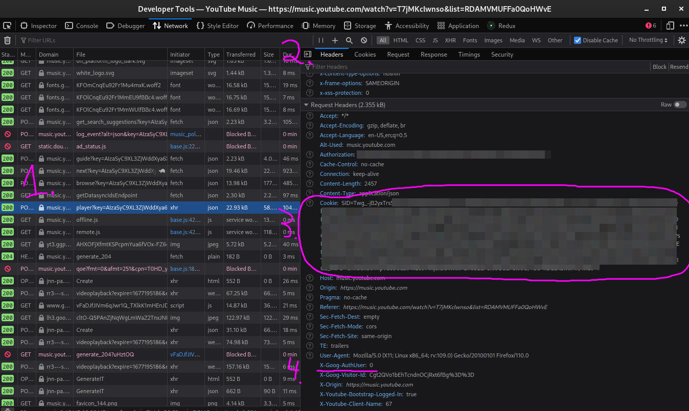

import Tabs from '@theme/Tabs';
import TabItem from '@theme/TabItem';
import CodeBlock from '@theme/CodeBlock';
import SchemaLink from "../../src/components/SchemaLink";
import AIOExample from "../../src/components/AIOExample";

import AIOConfig from '!!raw-loader!../../../config/config.json.example';
import ChromecastConfig from '!!raw-loader!../../../config/chromecast.json.example';
import DeezerConfig from '!!raw-loader!../../../config/chromecast.json.example';
import JellyfinConfig from '!!raw-loader!../../../config/jellyfin.json.example';
import JriverfinConfig from '!!raw-loader!../../../config/jriver.json.example';
import KodiConfig from '!!raw-loader!../../../config/kodi.json.example';
import LastfmConfig from '!!raw-loader!../../../config/lastfm.json.example';
import ListenbrainzConfig from '!!raw-loader!../../../config/listenbrainz.json.example';
import MalojaConfig from '!!raw-loader!../../../config/maloja.json.example';
import MopidyConfig from '!!raw-loader!../../../config/mopidy.json.example';
import MprisConfig from '!!raw-loader!../../../config/mpris.json.example';
import MusikcubeConfig from '!!raw-loader!../../../config/musikcube.json.example';
import MPDConfig from '!!raw-loader!../../../config/mpd.json.example';
import PlexConfig from '!!raw-loader!../../../config/plex.json.example';
import SpotifyConfig from '!!raw-loader!../../../config/spotify.json.example';
import SubsonicConfig from '!!raw-loader!../../../config/subsonic.json.example';
import TautulliConfig from '!!raw-loader!../../../config/tautulli.json.example';
import WebscrobblerConfig from '!!raw-loader!../../../config/webscrobbler.json.example';
import YTMusicConfig from '!!raw-loader!../../../config/ytmusic.json.example';
import VLCConfig from '!!raw-loader!../../../config/vlc.json.example';

# Configuration

:::tip

Check the [**FAQ**](../FAQ.md) if you have any issues after configuration!

:::

## Configuration Types

[**Sources** and **Clients**](/#how-does-multi-scrobbler-ms-work) are configured using:

* environmental (ENV) variables
* client/source specific json config files
* an all-in-one json config file

**MS will parse configuration from all configuration types.** You can mix and match configurations but it is generally better to stick to one or the other.

<Tabs groupId="configType" queryString>
    <TabItem value="env" label="ENV">
        This is done by passing environmental variables and so does not require any files to run MS.

        * Using a docker container EX `docker run -e "SPOTIFY_CLIENT_ID=yourId" -e "SPOTIFY_CLIENT_SECRET=yourSecret" ...`
        * Using a local installations by exporting variables before running MS EX `SPOTIFY_CLIENT_ID=yourId SPOTIFY_CLIENT_SECRET=yourSecret node index.js`

        Use ENV-based configuration if:

        * You are the only person for whom MS is scrobbling for
        * You have a very simple setup for MS such as one scrobble [Client](/#client) and one [Source](/#source) IE Plex -> Maloja
    </TabItem>
    <TabItem value="file" label="File">
        MS will parse configuration files located in the directory specified by the `CONFIG_DIR` environmental variable. This variable defaults to:

        * Local installation -> `PROJECT_DIR/config`
        * Docker -> `/config` (in the container) -- see the [install docs](../installation/installation.mdx#docker) for how to configure this correctly

        <details>

            <summary>Use File-based configuration if...</summary>

            * You have many [Sources](/#source)
            * You have many of each type of **Source** you want to scrobble from IE 2x Plex accounts, 3x Spotify accounts, 1x
            Funkwhale...
            * You have more than one scrobble **Client** you want to scrobble to IE multiple Maloja servers
            * You want only some **Sources** to scrobble to some **Clients** IE Fred's Spotify account scrobbles to Fred's Maloja
            server, but not Mary's Maloja server

        </details>

        :::tip
            * There are **example configurations** for all Source/Client types and AIO config located in the [`/config`](https://github.com/FoxxMD/multi-scrobbler/tree/master/config) directory of this project. These can be used as-is by renaming them to `.json`.
            * For docker/flatpak installations these examples are copied to your configuration directory on first-time use.
            * There is also a [**kitchensink example**](kitchensink.md) that provides examples of using all sources/clients in a complex configuration.
        :::

        Each file is named by the **type** of the Client/Source found in below sections. Each file as an **array** of that type of Client/Source.

        Example directory structure:

        ```
        /CONFIG_DIR
            plex.json
            spotify.json
            maloja.json
        ```

        <details>
            <summary>Config Example</summary>

            <CodeBlock title="CONFIG_DIR/spotify.json" language="json5">{SpotifyConfig}</CodeBlock>

        </details>
    </TabItem>
    <TabItem value="aio" label="File AIO">
        MS will parse an **all-in-one** configuration file located in the directory specified by the `CONFIG_DIR` environmental variable. This variable defaults to:

        * Local installation -> `PROJECT_DIR/config/config.json`
        * Docker -> `/config/config.json` (in the container) -- see the [install docs](../installation/installation.mdx#docker) for how to configure this correctly

        <details>

            <summary>Use AIO-based configuration if...</summary>

            * You have many [Sources](/#source)
            * You have many of each type of **Source** you want to scrobble from IE 2x Plex accounts, 3x Spotify accounts, 1x
            Funkwhale...
            * You have more than one scrobble **Client** you want to scrobble to IE multiple Maloja servers
            * You want only some **Sources** to scrobble to some **Clients** IE Fred's Spotify account scrobbles to Fred's Maloja
            server, but not Mary's Maloja server

        </details>

        **The AIO config also enables setting default options for sources/clients as well as global options for MS itself.**

        :::tip
            * An example AIO config files can be found in the project directory at [`/config/config.json.example`](https://github.com/FoxxMD/multi-scrobbler/tree/master/config/config.json.example)
            * For docker/flatpak installations this example is copied to your configuration directory on first-time use.
            * There is also a [**kitchensink example**](kitchensink.md) that provides examples of using all sources/clients in a complex configuration.
        :::

        [**Explore the schema for this configuration, along with an example generator and validator, here**](https://json-schema.app/view/%23?url=https%3A%2F%2Fraw.githubusercontent.com%2FFoxxMD%2Fmulti-scrobbler%2Fmaster%2Fsrc%2Fbackend%2Fcommon%2Fschema%2Faio.json)

        <details>

            <summary>Config Example</summary>

            <CodeBlock title="CONFIG_DIR/config.json" language="json5">{AIOConfig}</CodeBlock>

        </details>
    </TabItem>
</Tabs>

## Application Options

These options affect multi-scrobbler's behavior and are not specific to any source/client.

#### Base URL

Defines the URL that is used to generate default redirect URLs for authentication on [spotify](#spotify) and [lastfm](#lastfm) -- as well as some logging hints.

* Default => `http://localhost:9078`
* Set with [ENV](./configuration?configType=env#configuration-types) `BASE_URL` or `baseUrl` [all-in-one configuration](./configuration?configType=aio#configuration-types)
* If protocol is `http` or no protocol is specified MS will try to use port `9078` -- to override this explicitly set the port or use `https`

Useful when running with [docker](../installation/installation.mdx#docker) so that you do not need to specify redirect URLs for each configuration.

<details>

    <summary>Example</summary>

    EX Lastfm Redirect Url is `BASE_URL:PORT/lastfm/callback` (when no other redirectUri is specified for [lastfm configuration](#lastfm))

    | `BASE_URL`                          | Redirect URL                                             |
    |-------------------------------------|----------------------------------------------------------|
    | `192.168.0.101`                     | `http://192.168.0.101:9078/lastfm/callback`              |
    | `http://my.domain.local`            | `http://my.domain.local:9078/lastfm/callback`            |
    | `http://192.168.0.101/my/subfolder` | `http://192.168.0.101:9078/my/subfolder/lastfm/callback` |

    | `BASE_URL`                        | Redirect URL                                             |
    |-----------------------------------|----------------------------------------------------------|
    | `my.domain.local:80`              | `http://192.168.0.101:80/lastfm/callback`                |
    | `my.domain.local:9000`            | `http://my.domain.local:9000/lastfm/callback`            |
    | `192.168.0.101:4000/my/subfolder` | `http://192.168.0.101:4000/my/subfolder/lastfm/callback` |
    | `https://192.168.0.101`           | `https://192.168.0.101:443/lastfm/callback`              |

</details>

#### Disable Web

If you do not need the dashboard and/or ingress sources, or have security concerns about ingress and cannot control your hosting environment, the web server and API can be disabled.

:::warning

Any **ingress-based sources will be unusable** (Plex, Tautulli, etc...) if this is disabled.

:::

Disable using either:

* ENV `DISABLE_WEB=true`
* In [All-in-One File](./configuration?configType=aio#configuration-types) use the top-level property `"disableWeb": true`

## Source Configurations

### [Spotify](https://www.spotify.com)

To access your Spotify history you must [register an application](https://developer.spotify.com/dashboard) to get a
Client ID/Secret. Make sure to also whitelist your redirect URI in the application settings.

:::note

If your Spotify player has [Automix](https://community.spotify.com/t5/FAQs/What-is-Automix/ta-p/5257278) enabled and Spotify uses it for your playlist/queue then MS cannot accurately determine when a track will end. This is because the track is "mixed" in your queue with a shorter play time than its actual length and [Spotify does not report this modified play time in its API.](https://community.spotify.com/t5/Spotify-for-Developers/Wrong-duration-ms-of-track-with-Automix/m-p/5429147) This **does not affect MS's ability to scrobble** from Spotify but it will affect the accuracy of the duration MS reports was played.

:::

#### Configuration

<Tabs groupId="configType" queryString>
<TabItem value="env" label="ENV">
    | Environmental Variable     | Required? | Default                          |                    Description                     |
    |----------------------------|-----------|----------------------------------|----------------------------------------------------|
    | `SPOTIFY_CLIENT_ID`        | Yes       |                                  |                                                    |
    | `SPOTIFY_CLIENT_SECRET`    | Yes       |                                  |                                                    |
    | `SPOTIFY_REDIRECT_URI`     | No         | `http://localhost:9078/callback` | URI must end in `callback`                         |
</TabItem>
<TabItem value="file" label="File">
    <details>

        <summary>Example</summary>

        <CodeBlock title="CONFIG_DIR/spotify.json" language="json5">{SpotifyConfig}</CodeBlock>

    </details>

    or <SchemaLink lower objectName="SpotifySourceConfig"/>
</TabItem>
<TabItem value="aio" label="AIO">
    <details>

        <summary>Example</summary>

        <AIOExample data={SpotifyConfig} name="spotify"/>

    </details>
    or <SchemaLink lower objectName="SpotifySourceConfig"/>
</TabItem>
</Tabs>

### [Plex](https://plex.tv)

Check the [instructions](plex.md) on how to setup a [webhooks](https://support.plex.tv/articles/115002267687-webhooks) to scrobble your plays.

#### Configuration

<Tabs groupId="configType" queryString>
    <TabItem value="env" label="ENV">
        | Environmental Variable | Required | Default | Description                                                                                                                             |
        |------------------------|----------|---------|-----------------------------------------------------------------------------------------------------------------------------------------|
        | `PLEX_USER`            | No       |         | The a comma-delimited list of usernames to scrobble tracks for. No usernames specified means all tracks by all users will be scrobbled. |
    </TabItem>
    <TabItem value="file" label="File">

        <details>

            <summary>Example</summary>

            <CodeBlock title="CONFIG_DIR/plex.json" language="json5">{PlexConfig}</CodeBlock>

        </details>

        or <SchemaLink lower objectName="PlexSourceConfig"/>
    </TabItem>
    <TabItem value="aio" label="AIO">
        <details>

            <summary>Example</summary>

            <AIOExample data={PlexConfig} name="plex"/>

        </details>

        or <SchemaLink lower objectName="PlexSourceConfig"/>
    </TabItem>
</Tabs>

### [Tautulli](https://tautulli.com)

Check the [instructions](plex.md) on how to setup a notification agent.

#### Configuration

<Tabs groupId="configType" queryString>
    <TabItem value="env" label="ENV">
        | Environmental Variable | Required | Default | Description                                                                                                                             |
        |------------------------|----------|---------|-----------------------------------------------------------------------------------------------------------------------------------------|
        | `TAUTULLI_USER`        | No       |         | The a comma-delimited list of usernames to scrobble tracks for. No usernames specified means all tracks by all users will be scrobbled. |
    </TabItem>
    <TabItem value="file" label="File">

        <details>

            <summary>Example</summary>

            <CodeBlock title="CONFIG_DIR/tautulli.json" language="json5">{TautulliConfig}</CodeBlock>

        </details>

        or <SchemaLink lower objectName="TautulliSourceConfig"/>
    </TabItem>
    <TabItem value="aio" label="AIO">
        <details>

            <summary>Example</summary>

            <AIOExample data={TautulliConfig} name="tautulli"/>

        </details>

        or <SchemaLink lower objectName="TautulliSourceConfig"/>
    </TabItem>
</Tabs>

### [Subsonic](http://www.subsonic.org/)

Can use this source for any application that implements the [Subsonic API](http://www.subsonic.org/pages/api.jsp) and supports the [`getNowPlaying`](http://www.subsonic.org/pages/api.jsp#getNowPlaying) endpoint (such as [Airsonic](https://airsonic.github.io/) and [Navidrome](https://www.navidrome.org/))

:::warning[Known Issues]

* Multiple artists are reported as one value and cannot be separated
* If using [Airsonic Advanced](https://github.com/airsonic-advanced/airsonic-advanced) the password used (under **Credentials**) must be **Decodable**

:::

#### Configuration

<Tabs groupId="configType" queryString>
    <TabItem value="env" label="ENV">
        | Environmental Variable | Required? | Default | Description                          |
        |------------------------|-----------|---------|--------------------------------------|
        | `SUBSONIC_USER`        | Yes       |         |                                      |
        | `SUBSONIC_PASSWORD`    | Yes       |         |                                      |
        | `SUBSONIC_URL`         | Yes       |         | Base url of your subsonic-api server |
    </TabItem>
    <TabItem value="file" label="File">
        <details>

            <summary>Example</summary>

            <CodeBlock title="CONFIG_DIR/subsonic.json" language="json5">{SubsonicConfig}</CodeBlock>

        </details>

        or <SchemaLink lower objectName="SubSonicSourceConfig"/>
    </TabItem>
    <TabItem value="aio" label="AIO">
        <details>

            <summary>Example</summary>

            <AIOExample data={SubsonicConfig} name="subsonic"/>

        </details>

        or <SchemaLink lower objectName="SubSonicSourceConfig"/>
    </TabItem>
</Tabs>

### [Jellyfin](https://jellyfin.org/)

<details>

    <summary>Migrating from Webhook (multi-scrobbler below `v0.8.4`) to API</summary>

    In multi-scrobbler **below v0.9.0** communication with Jellyfin was done using Jellyfin's **Webhook** plugin.
    This has been deprecated in favor of directly using Jeyllfin's API for a better experience in multi-scrobbler.

    ### To Migrate:

    * Remove the **Webhook** plugin (if not using it for anything else)
    * Follow the new instructions below (outside this section) to setup API usage
    * The `servers` (`JELLYFIN_SERVERS`) setting is no longer available as MS only scrobbles from the server using the API anyways.
      * If you need to scrobble for multiple servers set up each server as a separate Jellyfin source
    * The `users` (`JELLYFIN_USER`) setting has been renamed `usersAllow` (`JELLYFIN_USERS_ALLOWED`)
      * If you were using this filter to ensure only scrobbles from yourself were registered then you no longer need this setting -- by default MS will only scrobble for the user authenticated with Jellyfin's API.

</details>

Must be using Jellyfin 10.7 or greater

* Create an **API Key** for multi-scrobbler
  * In the Jellyfin desktop web UI Navigate to -> Administration -> Dashboard -> API Keys (`http://YOUR_JELLYIN_URL/web/index.html#!/apikeys.html`)
  * Click `+` button and create a new key with **App name** `multi-scrobbler`
  * Copy the created API Key value for use in configuration below


It is **recommended** to use API Key + username but if you are not an admin for your Jellyfin instance you can also authenticate with your Jellyfin username and **password.**

:::tip[Important Defaults]

By default...

* multi-scrobbler will **only** scrobbling for the user authenticated with the API. 
  * Allowed Users (`usersAllow` or `JELLYFIN_USERS_ALLOW`) are only necessary if you want to scrobble for additional users.
* multi-scrobbler will only scrobble media found in Jellyfin libraries that were labelled as **Music.**
  * `librariesAllow` or `JELLYFIN_LIBRARIES_ALLOW` will override this
  * OR use `additionalAllowedLibraryTypes` to allow more types (like `mixed` or `book` for audiobooks)
* multi-scrobbler will only scrobble media Jellyfin detects as **Audio.**
  * To force multi-scrobbler to scrobble when media is detected as **Unknown** use `"allowUnknown": true` in file/aio configuration.

:::

#### Configuration

<Tabs groupId="configType" queryString>
    <TabItem value="env" label="ENV">
        | Environmental Variable     | Required? | Default | Description                                                                                |
        | -------------------------- | --------- | ------- | ------------------------------------------------------------------------------------------ |
        | `JELLYFIN_URL`             | **Yes**   |         | The URL of the Jellyfin server IE `http://localhost:8096`                                  |
        | `JELLYFIN_USER`            | **Yes**   |         | The user to authenticate with the API                                                      |
        | `JELLYFIN_APIKEY`          | No        |         | The API Key to use for authentication **(Must provide either apikey or password)**         |
        | `JELLYFIN_PASSWORD`        | No        |         | The password of the user to authenticate for. **(Must provide either apikey or password)** |
        | `JELLYFIN_USERS_ALLOW`     | No        |         | Comma-separated list of usernames (from Jellyfin) to scrobble for                          |
        | `JELLYFIN_USERS_BLOCK`     | No        |         | Comma-separated list of usernames (from Jellyfin) to disallow scrobble for                 |
        | `JELLYFIN_DEVICES_ALLOW`   | No        |         | Comma-separated list of devices to scrobble from                                           |
        | `JELLYFIN_DEVICES_BLOCK`   | No        |         | Comma-separated list of devices to disallow scrobbles from                                 |
        | `JELLYFIN_LIBRARIES_ALLOW` | No        |         | Comma-separated list of libraries to allow scrobbles from                                  |
        | `JELLYFIN_LIBRARIES_BLOCK` | No        |         | Comma-separated list of libraries to disallow scrobbles from                               |
    </TabItem>
    <TabItem value="file" label="File">
        <details>

            <summary>Example</summary>

            <CodeBlock title="CONFIG_DIR/jellyfin.json" language="json5">{JellyfinConfig}</CodeBlock>

        </details>

        or <SchemaLink lower objectName="JellyApiSourceConfig"/>

    </TabItem>
    <TabItem value="aio" label="AIO">
        <details>

            <summary>Example</summary>

            <AIOExample data={JellyfinConfig} name="jellyfin"/>

        </details>

        or <SchemaLink lower objectName="JellyApiSourceConfig"/>
    </TabItem>
</Tabs>

### [Last.fm (Source)](https://www.last.fm)

See the [Last.fm (Client)](#lastfm) setup for registration instructions.

#### Configuration

<Tabs groupId="configType" queryString>
    <TabItem value="env" label="ENV">
        No support for ENV based for Last.fm as a client (only source)
    </TabItem>
    <TabItem value="file" label="File">
        <details>
            Change `configureAs` to `source`

            <summary>Example</summary>

            <CodeBlock title="CONFIG_DIR/lastfm.json" language="json5">{LastfmConfig}</CodeBlock>

        </details>

        or <SchemaLink lower objectName="LastfmSourceConfig"/>
       </TabItem>
    <TabItem value="aio" label="AIO">
        <details>
            Change `configureAs` to `source`

            <summary>Example</summary>

            <AIOExample data={LastfmConfig} name="lastfm"/>

        </details>

        or <SchemaLink lower objectName="LastfmSourceConfig"/>
    </TabItem>
</Tabs>

### [Listenbrainz (Source)](https://listenbrainz.org)

You will need to run your own Listenbrainz server or have an account [on the official instance](https://listenbrainz.org/login/)

On your [profile page](https://listenbrainz.org/profile/) find your **User Token** to use in the configuration.


#### Configuration

<Tabs groupId="configType" queryString>
    <TabItem value="env" label="ENV">
        :::note
            You cannot use ENV variables shown in the [Listenbrainz Client config](#listenbrainz) -- multi-scrobbler assumes Listenbrainz ENVs are always used for the **client** configuration. You must use the file-based config from below to setup Listenbrainz as a Source.
        :::
    </TabItem>
    <TabItem value="file" label="File">
        <details>
            Change `configureAs` to `source`

            <summary>Example</summary>

            <CodeBlock title="CONFIG_DIR/listenbrainz.json" language="json5">{ListenbrainzConfig}</CodeBlock>

        </details>

        or <SchemaLink lower objectName="ListenBrainzSourceConfig"/>
    </TabItem>
    <TabItem value="aio" label="AIO">
        <details>
            Change `configureAs` to `source`

            <summary>Example</summary>

            <AIOExample data={ListenbrainzConfig} name="listenbrainz"/>

        </details>

        or <SchemaLink lower objectName="ListenBrainzSourceConfig"/>
    </TabItem>
</Tabs>

### [~~Deezer~~](https://deezer.com/)

:::warning

**This Source is DEPRECATED because Deezer has dropped official API support.** This Source will **not** be removed but no further support or fixes will be given.

Users cannot create new applications on Deezer Developers and there is no guarantee existing applications will continue to work.

As a workaround consider integrating Deezer with last.fm and then using [last.fm as a Source](#lastfm-source).

Users with existing Deezer applications in use with multi-scrobbler should consider this change as well to avoid future breaking issues with the unsupported API.

[See this issue for more discussion.](https://github.com/FoxxMD/multi-scrobbler/issues/175#issuecomment-2296776625)

:::

Create a new application at [Deezer Developers](https://developers.deezer.com/myapps)

* Application Domain must be the same as your multi-scrobbler domain. Default is `localhost:9078`
* Redirect URL must end in `deezer/callback`
  * Default would be `http://localhost:9078/deezer/callback`

After application creation you should have credentials displayed in the "My Apps" dashboard. You will need:

* **Application ID**
* **Secret Key**
* **Redirect URL** (if not the default)

**If no access token is provided...**

After starting multi-scrobbler with credentials in-place open the dashboard (`http://localhost:9078`) and find your Deezer source. Click **(Re)authenticate and (re)start polling** to start the login process. After login is complete polling will begin automatically.

#### Configuration

<Tabs groupId="configType" queryString>
    <TabItem value="env" label="ENV">
        | Environmental Variable | Required? | Default                                 | Description                       |
        |------------------------|-----------|-----------------------------------------|-----------------------------------|
        | `DEEZER_CLIENT_ID`     | Yes       |                                         | Your **Application ID**           |
        | `DEEZER_CLIENT_SECRET` | Yes       |                                         | Your **Secret Key**               |
        | `DEEZER_REDIRECT_URI`  | No        | `http://localhost:9078/deezer/callback` | URI must end in `deezer/callback` |
    </TabItem>
    <TabItem value="file" label="File">
        <details>

            <summary>Example</summary>

            <CodeBlock title="CONFIG_DIR/deezer.json" language="json5">{DeezerConfig}</CodeBlock>

        </details>

        or <SchemaLink lower objectName="DeezerSourceConfig"/>
    </TabItem>
    <TabItem value="aio" label="AIO">
        <details>

            <summary>Example</summary>

            <AIOExample data={DeezerConfig} name="deezer"/>

        </details>

        or <SchemaLink lower objectName="DeezerSourceConfig"/>
    </TabItem>
</Tabs>

### [Youtube Music](https://music.youtube.com)

:::note

* YT Music authentication is "browser based" which means your credentials may expire after a (long?) period of time OR if you log out of https://music.youtube.com. In the event this happens just repeat the steps below to get new credentials. [See the FAQ](../FAQ.md#youtube-music-fails-after-some-time) for a more detailed explanation.
* Communication to YT Music is **unofficial** and not supported or endorsed by Google. This means that **this integration may stop working at any time** if Google decides to change how YT Music works in the browser.
  * Due to this scrobble history from YTM is often inconsistent and can cause missed scrobbles. [See the FAQ](../FAQ.md#youtube-music-misses-scrobbles) for a more detailed explanation.

:::

Credentials for YT Music are obtained from a browser request to https://music.youtube.com **once you are logged in.** [Specific requirements are here and summarized below:](https://github.com/nickp10/youtube-music-ts-api/blob/master/DOCUMENTATION.md#authenticate)

* Open a new tab
* Open the developer tools (Ctrl-Shift-I) and select the “Network” tab 
* Go to https://music.youtube.com and ensure you are logged in 

Then...

1. Find and select an authenticated POST request. The simplest way is to filter by /browse using the search bar of the developer tools. If you don’t see the request, try scrolling down a bit or clicking on the library button in the top bar.
2. **Make sure **Headers** pane is selected and open
3. In the **Request Headers** section find and copy the **entire value** found after `Cookie:` and use this as the `cookie` value in your multi-scrobbler config
4. If present, in the **Request Headers** section find and copy the number found in `X-google-AuthUser` and use this as the value for `authUser` in your multi-scrobbler config



#### Configuration

<Tabs groupId="configType" queryString>
    <TabItem value="env" label="ENV">
        No ENV support
    </TabItem>
    <TabItem value="file" label="File">
        <details>

            <summary>Example</summary>

            <CodeBlock title="CONFIG_DIR/ytmusic.json" language="json5">{YTMusicConfig}</CodeBlock>

        </details>

        or <SchemaLink lower objectName="YTMusicSourceConfig"/>
    </TabItem>
    <TabItem value="aio" label="AIO">
        <details>

            <summary>Example</summary>

            <AIOExample data={YTMusicConfig} name="ytmusic"/>

        </details>

        or <SchemaLink lower objectName="YTMusicSourceConfig"/>
    </TabItem>
</Tabs>

### [MPRIS](https://specifications.freedesktop.org/mpris-spec/latest/)

MPRIS is a standard interface for communicating with Music Players on **linux operating systems.**

If you run Linux and have a notification tray that shows what media you are listening to, you likely have access to MPRIS.


multi-scrobbler can listen to this interface and scrobble tracks played by **any media player** that communicates to the operating system with MPRIS.

:::note

multi-scrobbler needs to be running as a [**Local Installation**](../installation/installation.mdx#nodejs) in order to use MPRIS. This cannot be used from docker.

:::

#### Configuration

<Tabs groupId="configType" queryString>
    <TabItem value="env" label="ENV">
        | Environmental Variable | Required? | Default | Description                                                                      |
        |------------------------|-----------|---------|----------------------------------------------------------------------------------|
        | MPRIS_ENABLE           | No        |         | Use MPRIS as a Source (useful when you don't need any other options)             |
        | MPRIS_BLACKLIST        | No        |         | Comma-delimited list of player names not to scrobble from                        |
        | MPRIS_WHITELIST        | No        |         | Comma-delimited list of players names to ONLY scrobble from. Overrides blacklist |
    </TabItem>
    <TabItem value="file" label="File">
        <details>

            <summary>Example</summary>

            <CodeBlock title="CONFIG_DIR/mpris.json" language="json5">{MprisConfig}</CodeBlock>

        </details>

        or <SchemaLink lower objectName="MPRISSourceConfig"/>
    </TabItem>
    <TabItem value="aio" label="AIO">
        <details>

            <summary>Example</summary>

            <AIOExample data={MprisConfig} name="mpris"/>

        </details>

        or <SchemaLink lower objectName="MPRISSourceConfig"/>
    </TabItem>
</Tabs>

### [Mopidy](https://mopidy.com/)

Mopidy is a headless music server that supports playing music from many [standard and non-standard sources such as Pandora, Bandcamp, and Tunein.](https://mopidy.com/ext/)

multi-scrobbler can scrobble tracks played from any Mopidy backend source, regardless of where you listen to them.

:::note

You must have [Mopidy-HTTP extension](https://mopidy.com/ext/http) enabled for this integration to work.

:::

#### Configuration {#mopidy-config}

<Tabs groupId="configType" queryString>
    <TabItem value="env" label="ENV">
        No ENV support
    </TabItem>
    <TabItem value="file" label="File">
        <details>

            <summary>Example</summary>

            <CodeBlock title="CONFIG_DIR/mopidy.json" language="json5">{MopidyConfig}</CodeBlock>

        </details>

        or <SchemaLink lower objectName="MopidySourceConfig"/>
    </TabItem>
    <TabItem value="aio" label="AIO">
        <details>

            <summary>Example</summary>

            <AIOExample data={MopidyConfig} name="mopidy"/>

        </details>

        or <SchemaLink lower objectName="MopidySourceConfig"/>
    </TabItem>
</Tabs>

#### Configuration Options

###### URL

The URL used to connect to the Mopidy server, set in your [file config as `url`.](#mopidy-config) The URL used to connect ultimately must be formed like this:

```
Syntax  => [protocol]://[hostname]:[port]/[path]
Default =>         ws://localhost:6680/mopidy/ws
```

If any part of this URL is missing multi-scrobbler will use a default value. This also means that if any part of your URL is **not** standard you must explicitly define it.

:::tip[Mopidy Configuration]

Make sure the hostname and port number match what is found in the Mopidy configuration file `mopidy.conf`:

```ini
[http]
hostname = localhost
port = 6680
```

:::

<details>
<summary>URL Transform Examples</summary>

    Examples of a given `url` in your file config and the final URL multi-scrobbler will use to connect to Mopidy:

    | `url`                          | Transformed URL                            |
    |--------------------------------|--------------------------------------------|
    | (none set)                     | `ws://localhost:6680/mopidy/ws`            |
    | `mopidy.mydomain.com`          | `ws://mopidy.mydomain.com:6680/mopidy/ws/` |
    | `192.168.0.101:3456`           | `ws://192.168.0.101:3456/mopidy/ws/`       |
    | `mopidy.mydomain.com:80/MOPWS` | `ws://mopidy.mydomain.com:80/MOPWS`        |

</details>


##### URI Blacklist/Whitelist

If you wish to disallow or only allow scrobbling from some sources played through Mopidy you can specify these using `uriBlacklist` or `uriWhitelist` in your config. multi-scrobbler will check the list to see if any string matches the START of the `uri` on a track. If whitelist is used then blacklist is ignored. All strings are case-insensitive.

<details>
    <summary>Example</summary>
    ```json
    {
        "uriBlacklist": ["soundcloud"]
    }
    ```

    Will prevent multi-scrobbler from scrobbling any Mopidy track that start with a `uri` like `soundcloud:song:MySong-1234`
</details>


##### Album Blacklist

For certain sources (Soundcloud) Mopidy does not have all track info (Album) and will instead use "Soundcloud" as the Album name. You can prevent multi-scrobbler from using this bad Album data by adding the fake Album name to this list. Multi-scrobbler will still scrobble the track, just without the bad data. All strings are case-insensitive.

<details>
    <summary>Example</summary>
    ```json
    {
        "albumBlacklist": ["SoundCloud", "Mixcloud"]
    }
    ```

    If a track would be scrobbled like
    ```
    Album: Soundcloud, Track: My Cool Track, Artist: A Cool Artist
    ```
    then multi-scrobbler will instead scrobble
    ```
    Track: My Cool Track, Artist: A Cool Artist
    ```
</details>

### [JRiver](https://jriver.com/)

In order for multi-scrobbler to communicate with JRiver you must have [Web Server Interface](https://wiki.jriver.com/index.php/Web_Service_Interface#Documentation_of_Functions) enabled. This can can be in the JRiver GUI:

* Tools -> Options -> Media Network
  * Check `Use Media Network to share this library...`
  * If you have `Authentication` checked you will need to provide the **Username** and **Password** in the ENV/File configuration below.

#### Configuration {#jriver-config}

<Tabs groupId="configType" queryString>
    <TabItem value="env" label="ENV">
        | Environmental Variable | Required |             Default             |                  Description                   |
        |------------------------|----------|---------------------------------|------------------------------------------------|
        | JRIVER_URL             | Yes      | http://localhost:52199/MCWS/v1/ | The URL of the JRiver server                   |
        | JRIVER_USERNAME        | No       |                                 | If authentication is enabled, the username set |
        | JRIVER_PASSWORD        | No       |                                 | If authenticated is enabled, the password set  |
    </TabItem>
    <TabItem value="file" label="File">
        <details>

            <summary>Example</summary>

            <CodeBlock title="CONFIG_DIR/jriver.json" language="json5">{JriverfinConfig}</CodeBlock>

        </details>

        or <SchemaLink lower objectName="JRiverSourceConfig"/>
    </TabItem>
    <TabItem value="aio" label="AIO">
        <details>

            <summary>Example</summary>

            <AIOExample data={JriverfinConfig} name="jriver"/>

        </details>

        or <SchemaLink lower objectName="JRiverSourceConfig"/>
    </TabItem>
</Tabs>

##### URL

The URL used to connect to JRiver, set in your [file config as `url`.](#jriver-config) The URL used to connect ultimately must be formed like this:

```
Syntax  => [protocol]://[hostname]:[port]/[path]
Default =>       http://localhost:52199/MCWS/v1/
```

If any part of this URL is missing multi-scrobbler will use a default value. This also means that if any part of your URL is **not** standard you must explicitly define it.

:::tip[Jriver Settings]

* Make sure the port number matches what is found in `Advanced` section in the [Media Network](#jriver) options.
* If your installation is on the same machine but you cannot connect using `localhost` try `0.0.0.0` instead.

:::

<details>
    <summary>URL Transform Examples</summary>

    Examples of a given `url` in your file config and the final URL multi-scrobbler will use to connect to JRiver:

    | `url`                                    | Transformed URL                             |
    |------------------------------------------|---------------------------------------------|
    | (none set)                               | `http://localhost:52199/MCWS/v1/`           |
    | `jriver.mydomain.com`                    | `http://jriver.mydomain.com:52199/MCWS/v1/` |
    | `192.168.0.101:3456`                     | `http://192.168.0.101:3456/MCWS/v1/`        |
    | `mydomain.com:80/jriverReverse/MCWS/v1/` | `mydomain.com:80/jriverReverse/MCWS/v1/`    |

</details>

### [Kodi](https://kodi.tv/)

In order for multi-scrobbler to communicate with Kodi you must have the [Web Interface](https://kodi.wiki/view/Web_interface) enabled. This can be done in the Kodi GUI:

* Settings -> Services -> Control
  * Check `Allow remote control via HTTP`
  * Ensure you have a **Username** and **Password** set, you will need to provide them in the ENV/File configuration below.

#### Configuration {#kodi-config}

<Tabs groupId="configType" queryString>
    <TabItem value="env" label="ENV">
        | Environmental Variable | Required | Default                       | Description                |
        |------------------------|----------|-------------------------------|----------------------------|
        | KODI_URL               | Yes      | http://localhost:8080/jsonrpc | The URL of the Kodi server |
        | KODI_USERNAME          | No       |                               | The username set           |
        | KODI_PASSWORD          | No       |                               | The password set           |
    </TabItem>
    <TabItem value="file" label="File">
        <details>

            <summary>Example</summary>

            <CodeBlock title="CONFIG_DIR/kodi.json" language="json5">{KodiConfig}</CodeBlock>

        </details>

        or <SchemaLink lower objectName="KodiSourceConfig"/>
    </TabItem>
    <TabItem value="aio" label="AIO">
        <details>

            <summary>Example</summary>

            <AIOExample data={KodiConfig} name="kodi"/>

        </details>

        or <SchemaLink lower objectName="KodiSourceConfig"/>
    </TabItem>
</Tabs>

##### URL

The URL used to connect to Kodi, set in your [file config as `url`.](#kodi-config) The URL used to connect ultimately must be formed like this:

```
Syntax  => [protocol]://[hostname]:[port]/[path]
Default =>       http://localhost:8080/jsonrpc
```

If any part of this URL is missing multi-scrobbler will use a default value. This also means that if any part of your URL is **not** standard you must explicitly define it.

:::tip[Kodi Settings]

* Make sure the port number matches what is found in **Port** in the [Control](#kodi) section mentioned above.
* If your installation is on the same machine but you cannot connect using `localhost` try `0.0.0.0` instead.

:::

<details>
    <summary>URL Transform Examples</summary>

    Examples of a given `url` in your file config and the final URL multi-scrobbler will use to connect to Kodi:

    | `url`                                 | Transformed URL                              |
    |---------------------------------------|----------------------------------------------|
    | (none set)                            | `http://localhost:8080/jsonrpc`              |
    | `kodi.mydomain.com`                   | `http://kodi.mydomain.com:8080/jsonrpc`      |
    | `192.168.0.101:3456`                  | `http://192.168.0.101:3456/jsonprc`          |
    | `mydomain.com:80/kodiReverse/jsonrpc` | `http://mydomain.com:80/kodiReverse/jsonrpc` |

</details>

### [WebScrobbler](https://web-scrobbler.com/)

After installing the extension open the preferences/settings for it:

* Under **Accounts**
  * **Add Webhook**
    * API URL: `[YourMultiScrobblerInstance]/api/webscrobbler` EX `http://localhost:9078/api/webscrobbler`
    * Application name: `(whatever you want)`

Reload the extension after adding the webhook.

:::note

* **On Firefox** - Only FQNs (domain.tld), `localhost`, and `127.0.0.1` are supported for API URL due to [firefox requiring https](https://github.com/web-scrobbler/web-scrobbler/issues/4183#issuecomment-1749222006)
* **On Chromium-based Browsers** - Any domain will work for API URL
* All other browsers are untested

:::

:::warning

Multi-scrobbler is **not** designed to be publicly accessible from the internet. To use Webscrobbler outside your local network you should be accessing MS through a VPN or through a reverse proxy with some kind of authentication (though this is still not recommended).

:::

#### Configuration {#webscrobbler-config}

<Tabs groupId="configType" queryString>
    <TabItem value="env" label="ENV">
        | Environmental Variable | Required? | Default | Description                                                              |
        |------------------------|-----------|---------|--------------------------------------------------------------------------|
        | WS_ENABLE              | No        |         | Set to 'true' to enable WS without needing to define other ENVs          |
        | WS_WHITELIST           | No        |         | Only scrobble from these WebScrobbler Connectors. Comma-delimited list   |
        | WS_BLACKLIST           | No        |         | Do not scrobble from these WebScrobbler Connectors. Comma-delimited list |
    </TabItem>
    <TabItem value="file" label="File">
        <details>

            <summary>Example</summary>

            <CodeBlock title="CONFIG_DIR/webscrobbler.json" language="json5">{WebscrobblerConfig}</CodeBlock>

        </details>

        or <SchemaLink lower objectName="WebScrobblerSourceConfig"/>
    </TabItem>
    <TabItem value="aio" label="AIO">
        <details>

            <summary>Example</summary>

            <AIOExample data={WebscrobblerConfig} name="webscrobbler"/>

        </details>

        or <SchemaLink lower objectName="WebScrobblerSourceConfig"/>
    </TabItem>
</Tabs>

##### Multiple Users

If you would like use multiple WebScrobbler sources they can be matched using a **slug** at the end of the **API URL.** This requires using [a file-based config.](./configuration?configType=file#webscrobbler-config)

<details>

    <summary>Example</summary>

    ```json title="webscrobbler.json"
    [
      {
        "name": "aUserWS",
        "clients": [
          "client1Maloja"
        ],
        "data": {
          "slug": "usera"
        }
      },
      {
        "name": "bUserWS",
        "clients": [
          "client2Maloja"
        ],
        "data": {
          "slug": "userb"
        }
      }
    ]
    ```

    * To use `aUserWS` source set **API URL** to `http://localhost:9078/api/webscrobbler/usera`
    * To use `bUserWS` source set **API URL** to `http://localhost:9078/api/webscrobbler/userb`

    :::tip

    `http://localhost:9078/api/webscrobbler` is matched with the first source that _that does not have a slug defined._

    :::

</details>

###### Connectors Black/Whitelist

MS can be configured to only scrobble, or NOT scrobble, from some WS connectors. Use the name of the website from the [supported websites](https://web-scrobbler.com/) or from the **Connectors** tab in the extension. 

:::note

This affects **only** MS's behavior and does not affect the general connector behavior you have configured within the WebScrobbler extension.

:::

### [Google Cast (Chromecast)](https://www.google.com/chromecast/built-in/)

If your media device can be **Cast** to using this button  on your phone/computer then multi-scrobbler can monitor it in order to scrobble music you play.


:::note 

Google Cast support is **experimental**. You may experience crashes and errors while using this Source. Please open an issue if you experience problems and include all information detailed in the issue template to help debug your issue.

:::

:::note 

This source relies on common, **basic** music data provided by the cast device which will always be less exhaustive than data parsed from full source integrations. If there is an existing [Source](#source-configurations) it is recommended to configure for it and blacklist the app on Google Cast, rather than relying solely on Google Cast for scrobbling.

:::

#### Configuration

<Tabs groupId="configType" queryString>
    <TabItem value="env" label="ENV">
        :::note
        [Manually configuring cast device connections](#connecting-devices) is only available through file-based config.
        :::

        | Environmental Variable | Required? | Default |                                     Description                                      |
        |------------------------|-----------|---------|--------------------------------------------------------------------------------------|
        | CC_ENABLE              | No        |         | Set to 'true' to enable Cast monitoring without needing to define other ENVs         |
        | CC_WHITELIST_DEVICES   | No        |         | Only scrobble from these Cast devices. Comma-delimited list. EX mini-home, family-tv |
        | CC_BLACKLIST_DEVICES   | No        |         | Do not scrobble from these Cast devices. Comma-delimited list                        |
        | CC_WHITELIST_APPS      | No        |         | Only scrobble from these casted Apps. Comma-delimited list. EX spotify, pandora      |
        | CC_BLACKLIST_APPS      | No        |         | Do not scrobble from these casted Apps. Comma-delimited list                         |
    </TabItem>
    <TabItem value="file" label="File">

        <details>

            <summary>Example</summary>

            <CodeBlock title="CONFIG_DIR/chromecast.json" language="json5">{ChromecastConfig}</CodeBlock>

        </details>

        or <SchemaLink lower objectName="ChromecastSourceConfig"/>
    </TabItem>
    <TabItem value="aio" label="AIO">
        <details>

            <summary>Example</summary>

            <AIOExample data={ChromecastConfig} name="chromecast"/>

        </details>

        or <SchemaLink lower objectName="ChromecastSourceConfig"/>
    </TabItem>
</Tabs>

#### Connecting Devices

Cast devices can be manually configured using file-based configuration OR automatically discovered using **mDNS.**

###### mDNS Discovery

The host machine running multi-scrobbler must be configured to allow [mDNS traffic on port 5353/UDP](https://book.hacktricks.xyz/network-services-pentesting/5353-udp-multicast-dns-mdns).

<details>

    <summary>OS Specific Instructions</summary>

<Tabs>
    <TabItem value="linux" label="Linux">
        **Docker**

        The host machine must have [avahi-daemon](https://avahi.org/) running to circumvent limitations with DNS resolution due to musl in Alpine. Most major linux distributions package avahi and many have it built-in. Once avahi is running you must pass D-Bus and the avahi daemon socket to your container like so:

        ```
        docker run ... -v /var/run/dbus:/var/run/dbus -v  	/var/run/avahi-daemon/socket:/var/run/avahi-daemon/socket ... foxxmd/multi-scrobbler
        ```

        **Flatpak/Nodejs**

        No additional steps are required.
    </TabItem>
    <TabItem value="windows" label="Windows">
        **Docker**

        Unsupported at this time.

        **Nodejs**

        No additional steps are required.
    </TabItem>
</Tabs>

</details>

#### What Media Does MS Scrobble?

Cast devices report what type of media the current activity is [(see `metadata` property here)](https://developers.google.com/cast/docs/media/messages#MediaInformation). The reported type is dependent on the application playing the media to correctly report it, the cast device does not magically know what the media is. If an application does not report a type it is always classified as `unknown`.

**By default, MS will only track media that is reported as `MusicTrack`.**

##### Allow Unknown Media Type

Media with an Unknown (`Generic`) media type can be explicitly allowed by setting `"allowUnknownMedia": true` in the file-based configuration. This can also be configured to only allow unknown media types for specific applications by using a list of application names.

<details>

    <summary>Example</summary>

    ```json5 title="chromecast.json"
    [
      {
        "name": "MyCast",
        "type": "chromecast",
        "data": {
          // only allow unknown if app name contains any of these phrases
          "allowUnknownMedia": ["smarttube", "default media receiver"]
        },
      }
    ]
    ```

</details>

##### Forcing Media Tracking

MS can be forced to track media from an application regardless of media type. This is useful if an application incorrectly reports a media type you are sure should be music. Set `"forceMediaRecognitionOn"` in the file-based configuration to a list of application names that should always be tracked.

<details>

    <summary>Example</summary>

    ```json5 title="chromecast.json"
    [
      {
        "name": "MyCast",
        "type": "chromecast",
        "data": {
          // media from applications that contains these phrases will always be tracked, regardless of media type reported
          "forceMediaRecognitionOn": ["smarttube", "default media receiver"]
        },
      }
    ]
    ```

</details>

#### Cast Troubleshooting

Please include any/all logs with raw output if there are any errors encountered as this is critical to diagnosing issues.

To diagnose bad/incomplete track information or strange MS player behavior please turn on **payload logging** and include log output of the source running to help diagnose this issue.

<details>

    <summary>Example</summary>

    ```json5 title="chromecast.json"
    [
      {
        "name": "MyCast",
        "type": "chromecast",
        "data": {
          //...
        },
        "options": {
          "logPayload": true
        }
      }
    ]
    ```

</details>

### [Musikcube](https://musikcube.com)

In order to use Musikcube configure it to accept [websocket connections](https://github.com/clangen/musikcube/wiki/remote-api-documentation) in **server setup**:

* Enable the **Metadata Server**
* Set a **Password**

Both of these settings are found in _Musikcube -> (s)ettings -> server setup_


The URL used by MS has the syntax:

```
[ws|wss]://HOST:[PORT]
```

The **port** is the same as shown in the server setup screenshot from above, under **metadata server enabled**. If no port is provided to MS it will default to `7905`.

If no URL is provided to MS it will try to use `ws://localhost:7905`

#### Configuration

<Tabs groupId="configType" queryString>
    <TabItem value="env" label="ENV">
        | Environmental Variable | Required? | Default               | Description                          |
        |------------------------|-----------|-----------------------|--------------------------------------|
        | `MC_URL`               | No        | `ws://localhost:7905` | Use port set for **metadata server** |
        | `MC_PASSWORD`          | Yes       |                       |                                      |
    </TabItem>
    <TabItem value="file" label="File">
        <details>

            <summary>Example</summary>

            <CodeBlock title="CONFIG_DIR/musikcube.json" language="json5">{MusikcubeConfig}</CodeBlock>

        </details>

        or <SchemaLink lower objectName="MusikcubeSourceConfig"/>
    </TabItem>
    <TabItem value="aio" label="AIO">
        <details>

            <summary>Example</summary>

            <AIOExample data={MusikcubeConfig} name="musikcube"/>

        </details>

        or <SchemaLink lower objectName="MusikcubeSourceConfig"/>
    </TabItem>
</Tabs>

### [MPD (Music Player Daemon)](https://www.musicpd.org/)

MS communicates with MPD using the [TCP client connection.](https://mpd.readthedocs.io/en/stable/user.html#client-connections)

You should uncomment/create the following settings in your mpd config:

```
bind_to_address	"any"   # or a specific ipv4/v6 address
port            "6600"
```

<!-- MS will also discover MPD servers if [zeroconf support](https://mpd.readthedocs.io/en/stable/user.html#zeroconf) is enabled and MS is set up to utilize mDNS. This can be disabled in file-config options. -->

#### Configuration

<Tabs groupId="configType" queryString>
    <TabItem value="env" label="ENV">
        | Environmental Variable | Required? | Default          | Description |
        |------------------------|-----------|------------------|-------------|
        | `MPD_URL`              | No        | `localhost:6600` |             |
        | `MPD_PASSWORD`         | No        |                  |             |
    </TabItem>
    <TabItem value="file" label="File">
        <details>

            <summary>Example</summary>

            <CodeBlock title="CONFIG_DIR/mpd.json" language="json5">{MPDConfig}</CodeBlock>

        </details>

        or <SchemaLink lower objectName="MPDSourceConfig"/>
    </TabItem>
    <TabItem value="aio" label="AIO">
        <details>

            <summary>Example</summary>

            <AIOExample data={MPDConfig} name="mpd"/>

        </details>

        or <SchemaLink lower objectName="MPDSourceConfig"/>
    </TabItem>
</Tabs>

### [VLC](https://www.videolan.org/vlc/)

MS communicates with VLC using the [Web (`http`) interface module](https://wiki.videolan.org/VLC_HTTP_requests/)

#### Enable HTTP Interface

Open VLC:

* **Tools** Menu -> Preferences
  * In the bottom left change **Show Settings** from `Simple` to `All`
  * In the updated window select `Interface -> Main interfaces`
     * In the **Extra interface modules** section enable **Web** and verify that `http` is shown in the textbox
  * Select `Interface -> Main interfaces -> Lua`
    * In Lua HTTP -> Password -> set a password in this box
  * Click **Save** at the bottom to persist your changes
* Restart VLC
* Verify the HTTP interface is accessible by navigating to `http://localhost:8080` in your browser

If the interface is accessible, after typing in your password, VLC  is now ready to be used by MS.

##### Setting VLC Interface and Port

These can be set by starting VLC from command line with specific options:

* `vlc --http-host yourHostIp:yourPort` or
* `vlc --http-port yourPort` or
* modify the configuration file for VLC by editing keys with the same values as from the command line (`http-host` and `http-port`)


#### Configuration

<Tabs groupId="configType" queryString>
    <TabItem value="env" label="ENV">
        | Environmental Variable | Required?  | Default          | Description |
        |------------------------|------------|------------------|-------------|
        | `VLC_URL`              | No         | `localhost:8080` |             |
        | `VLC_PASSWORD`         | Yes        |                  |             |
    </TabItem>
    <TabItem value="file" label="File">
        <details>

            <summary>Example</summary>

            <CodeBlock title="CONFIG_DIR/vlc.json" language="json5">{VLCConfig}</CodeBlock>

        </details>

        or <SchemaLink lower objectName="VLCSourceConfig"/>
    </TabItem>
    <TabItem value="aio" label="AIO">
        <details>

            <summary>Example</summary>

            <AIOExample data={VLCConfig} name="vlc"/>

        </details>

        or <SchemaLink lower objectName="VLCSourceConfig"/>
    </TabItem>
</Tabs>

#### Filename Parsing

If the file being played in VLC does not have ID3 tags/metadata information multi-scrobbler can attempt to extract artist, title, and album information from the raw filename using regular expressions. Mutli-scrobbler will only do this if there is **no other information** reported by VLC about these fields.

To extract this information use [named capture groups](https://developer.mozilla.org/en-US/docs/Web/JavaScript/Reference/Regular_expressions/Named_capturing_group) in your expression matching the field that should be extracted: `artist` `title` and/or `album`. MS accepts multiple expressions, the first one that matches a filename will be used.

<!-- Would like to put this in a <details> node but the <> in the named capture groups are causing the parser to incorrectly parse them as an actual tag  -->

Example usage in [a file-based config:](./configuration?configType=file#webscrobbler-config)

```json5 title="config/vlc.json" {10-15}
[
  {
    "name": "MyVlc",
    "enable": true,
    "data": {
      // ...
    },
    "options": {
      "filenamePatterns": [
          // Extracts artist and title from filenames that look like:
          // My Artist - My Cool title.mp4
          "/^\\s*(?<artist>.+?) - (?<title>.+?)\\.\\w+$/i"
        ],
      // logs to DEBUG when MS tries to extract data from a filename
      "logFilenamePatterns": true,
    }
  }
]
```

#### Vlc Information Reporting

If you find that VLC is incorrectly reporting track information (in its interface) but multi-scrobbler is not parsing it correctly it may be due to the _name_ of the fields VLC is reporting. mutli-scrobbler uses the most common field name but does not cover all use cases. Before reporting an issue please turn on metadata logging and include output from your logs while it is turned on:

```json5 title="config/vlc.json" {9-9}
    [
      {
        "name": "MyVlc",
        "enable": true,
        "data": {
          // ...
        },
        "options": {
          "dumpVlcMetadata": true
        }
      }
    ]
```

## Client Configurations

### [Maloja](https://github.com/krateng/maloja)

#### Configuration

<Tabs groupId="configType" queryString>
    <TabItem value="env" label="ENV">
        | Environmental Variable | Required? | Default | Description                   |
        |------------------------|-----------|---------|-------------------------------|
        | `MALOJA_URL`           | Yes       |         | Base URL of your installation |
        | `MALOJA_API_KEY`       | Yes       |         | Api Key                       |
    </TabItem>
    <TabItem value="file" label="File">

        <details>

            <summary>Example</summary>

            <CodeBlock title="CONFIG_DIR/maloja.json" language="json5">{MalojaConfig}</CodeBlock>

        </details>

        or <SchemaLink client lower objectName="MalojaClientConfig"/>
    </TabItem>
    <TabItem value="aio" label="AIO">
        <details>

            <summary>Example</summary>

            <AIOExample client data={MalojaConfig} name="maloja"/>

        </details>

        or <SchemaLink client lower objectName="MalojaClientConfig"/>
    </TabItem>
</Tabs>

### [Last.fm](https://www.last.fm)

[Register for an API account here.](https://www.last.fm/api/account/create)

The Callback URL is actually specified by multi-scrobbler but to keep things consistent you should use
```
http://localhost:9078/lastfm/callback
```
or replace `localhost:9078` with your own base URL

#### Configuration

<Tabs groupId="configType" queryString>
    <TabItem value="env" label="ENV">
        | Environmental Variable | Required? | Default                                 | Description                                                                   |
        |------------------------|-----------|-----------------------------------------|-------------------------------------------------------------------------------|
        | `LASTFM_API_KEY`       | Yes       |                                         | Api Key from your API Account                                                 |
        | `LASTFM_SECRET`        | Yes       |                                         | Shared secret from your API Account                                           |
        | `LASTFM_REDIRECT_URI`  | No        | `http://localhost:9078/lastfm/callback` | Url to use for authentication. Must include `lastfm/callback` somewhere in it |
        | `LASTFM_SESSION`       | No        |                                         | Session id. Will be generated by authentication flow if not provided.         |
    </TabItem>
    <TabItem value="file" label="File">

        <details>

            <summary>Example</summary>

            <CodeBlock title="CONFIG_DIR/lastfm.json" language="json5">{LastfmConfig}</CodeBlock>

        </details>

        or <SchemaLink client lower objectName="LastfmClientConfig"/>
    </TabItem>
    <TabItem value="aio" label="AIO">
        <details>

            <summary>Example</summary>

            <AIOExample client data={LastfmConfig} name="lastfm"/>

        </details>

        or <SchemaLink client lower objectName="LastfmClientConfig"/>
    </TabItem>
</Tabs>

### [Listenbrainz](https://listenbrainz.org)

You will need to run your own Listenbrainz server or have an account [on the official instance](https://listenbrainz.org/login/)

On your [profile page](https://listenbrainz.org/profile/) find your **User Token** to use in the configuration.

#### Configuration

<Tabs groupId="configType" queryString>
    <TabItem value="env" label="ENV">
        | Environmental Variable | Required? |            Default            |           Description           |
        |------------------------|-----------|-------------------------------|---------------------------------|
        | LZ_TOKEN               | Yes       |                               | User token from your LZ profile |
        | LZ_USER                | Yes       |                               | Your LZ username                |
        | LZ_URL                 | No        | https://api.listenbrainz.org/ | The base URL for the LZ server  |
    </TabItem>
    <TabItem value="file" label="File">

        <details>

            <summary>Example</summary>

            <CodeBlock title="CONFIG_DIR/listenbrainz.json" language="json5">{ListenbrainzConfig}</CodeBlock>

        </details>

        or <SchemaLink client lower objectName="ListenBrainzClientConfig"/>
    </TabItem>
    <TabItem value="aio" label="AIO">
        <details>

            <summary>Example</summary>

            <AIOExample client data={ListenbrainzConfig} name="listenbrainz"/>

        </details>

        or <SchemaLink client lower objectName="ListenBrainzClientConfig"/>
    </TabItem>
</Tabs>

## Monitoring

multi-scrobbler supports some common webhooks and a healthcheck endpoint in order to monitor Sources and Clients for errors.

### Webhook Configurations

Webhooks will **push** a notification to your configured servers on these events:

* Source polling started 
* Source polling retry
* Source polling stopped on error 
* Scrobble client scrobble failure

Webhooks are configured in the AIO [config.json](#configuration-types) file under the `webhook` top-level property. Multiple webhooks may be configured for each webhook type.

<details>

    <summary>Example</summary>

    ```json5 title="config.json"
    {
      "sources": [
        //...
      ],
      "clients": [
        //...
      ],
      "webhooks": [
        {
          "name": "FirstGotifyServer",
          "type": "gotify",
          "url": "http://192.168.0.100:8070",
          "token": "abcd"
        },
        {
          "name": "SecondGotifyServer",
          "type": "gotify",
          //...
        },
        {
          "name": "NtfyServerOne",
          "type": "ntfy",
          //...
        },
        //...
      ]
    }
    ```

</details>

#### [Gotify](https://gotify.net/)

Refer to the [config schema for GotifyConfig](https://json-schema.app/view/%23/%23%2Fdefinitions%2FGotifyConfig?url=https%3A%2F%2Fraw.githubusercontent.com%2FFoxxMD%2Fmulti-scrobbler%2Fmaster%2Fsrc%2Fbackend%2Fcommon%2Fschema%2Faio.json)

multi-scrobbler optionally supports setting message notification priority via `info` `warn` and `error` mappings.

<details>

    <summary>Example</summary>

    ```json title="config.json"
    {
      "type": "gotify",
      "name": "MyGotifyFriendlyNameForLogs",
      "url": "http://192.168.0.100:8070",
      "token": "AQZI58fA.rfSZbm",
      "priorities": {
        "info": 5,
        "warn": 7,
        "error": 10
      }
    }
```

</details>

#### [Ntfy](https://ntfy.sh/)

Refer to the [config schema for NtfyConfig](https://json-schema.app/view/%23/%23%2Fdefinitions%2FNtfyConfig?url=https%3A%2F%2Fraw.githubusercontent.com%2FFoxxMD%2Fmulti-scrobbler%2Fmaster%2Fsrc%2Fbackend%2Fcommon%2Fschema%2Faio.json)

multi-scrobbler optionally supports setting message notification priority via `info` `warn` and `error` mappings.

<details>

    <summary>Example</summary>

    ```json title="config.json"
    {
      "type": "ntfy",
      "name": "MyNtfyFriendlyNameForLogs",
      "url": "http://192.168.0.100:9991",
      "topic": "RvOwKJ1XtIVMXGLR",
      "username": "Optional",
      "password": "Optional",
      "priorities": {
        "info": 3,
        "warn": 4,
        "error": 5
      }
    }
```

</details>

#### [Apprise](https://github.com/caronc/apprise-api)

Refer to the [config schema for AppriseConfig](https://json-schema.app/view/%23/%23%2Fdefinitions%2FAppriseConfig?url=https%3A%2F%2Fraw.githubusercontent.com%2FFoxxMD%2Fmulti-scrobbler%2Fmaster%2Fsrc%2Fbackend%2Fcommon%2Fschema%2Faio.json)

multi-scrobbler supports [stateless](https://github.com/caronc/apprise-api?tab=readme-ov-file#stateless-solution) and [persistent storage](https://github.com/caronc/apprise-api?tab=readme-ov-file#persistent-storage-solution) endpoints as well as [tags](https://github.com/caronc/apprise-api?tab=readme-ov-file#tagging)/

<details>

    <summary>Example</summary>

    ```json5 title="config.json"
    {
      "type": "apprise",
      "name": "MyAppriseFriendlyNameForLogs",
      "host": "http://192.168.0.100:8080",
      "urls": ["gotify://192.168.0.101:8070/MyToken"], // stateless endpoints
      "keys": ["e90b20526808373353afad7fb98a201198c0c3e0555bea19f182df3388af7b17"], //persistent storage endpoints
      "tags": ["my","optional","tags"]
    }
    ```

</details>

### Health Endpoint

An endpoint for monitoring the health of sources/clients is available at GET `http://YourMultiScrobblerDomain/health`

* Returns `200 OK` when **everything** is working or `500 Internal Server Error` if **anything** is not 
* The plain url (`/health`) aggregates status of **all clients/sources** -- so any failing client/source will make status return 500 
  * Use query params `type` or `name` to restrict client/sources aggregated IE `/health?type=spotify` or `/health?name=MyMaloja`
* On 500 the response returns a JSON payload with `messages` array that describes any issues
  * For any clients/sources that require authentication `/health` will return 500 if they are **not authenticated** 
  * For sources that poll (spotify, yt music, subsonic) `/health` will 500 if they are **not polling**
