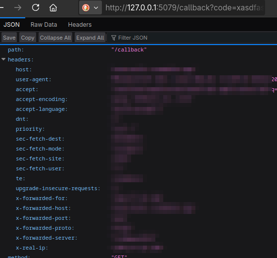

import Tabs from '@theme/Tabs';
import TabItem from '@theme/TabItem';
import CodeBlock from '@theme/CodeBlock';
import SpotifyConfig from '!!raw-loader!@site/../config/spotify.json.example';

<details>

<summary>Spotify and Automix</summary>

If your Spotify player has [Automix](https://community.spotify.com/t5/FAQs/What-is-Automix/ta-p/5257278) enabled and Spotify uses it for your playlist/queue then MS cannot accurately determine when a track will end. This is because the track is "mixed" in your queue with a shorter play time than its actual length and [Spotify does not report this modified play time in its API.](https://community.spotify.com/t5/Spotify-for-Developers/Wrong-duration-ms-of-track-with-Automix/m-p/5429147) This **does not affect MS's ability to scrobble** from Spotify but it will affect the accuracy of the duration MS reports was played.

</details>

#### Authenticate Spotify with Multi-Scrobbler

To access your Spotify history you must [create a Spotify App](https://developer.spotify.com/dashboard) to get a
Client ID/Secret.

1. **Login to https://developer.spotify.com** with your existing Spotify account and accept Developer Terms

2. Navigate to your Spotify Developer [Dashboard](https://developer.spotify.com/dashboard) and start the **Create App** process

3. Determine the correct **Redirect URI** to use and set it in your App settings

<details>

<summary>Redirect URI Instructions</summary>

A Redirect URI is the URL that Spotify will navigate your **browser** to after you complete authorization. The URL will contain the code necessary for multi-scrobbler to get a Spotify access token.

Spotify [**no longer allows insecure URIs**](https://developer.spotify.com/documentation/web-api/tutorials/migration-insecure-redirect-uri) (start with `http://`) unless the address is `127.0.0.1` -- so `localhost` and internal IPs (`192.168.0.xxx`) no longer work.

Use **one** of the following methods to specify a valid Redirect URI and complete Spotify authentication with multi-scrobbler:

<Tabs groupId="spotifyRedirect" queryString>
    <TabItem value="https" label="HTTPS">
        **Use a domain you control, with SSL certificates/HTTPS enabled, to create a valid redirect URI.**
        
        For example, if you are already running multi-scrobbler behind a reverse proxy (nginx/traefik/caddy) at `https://scrobbler.mydomain.com` then set the Spotify Redirect URI for your Spotify App, and multi-scrobbler `SPOTIFY_REDIRECT_URI` ENV, to `https://scrobbler.mydomain.com/callback`

        Alternatively, if multi-scrobbler is not accessible behind your domain, then use the [**Echo**](./?spotifyRedirect=echo) method with your own domain instead of 127.0.0.1.
    </TabItem>
    <TabItem value="local" label="Run MS Locally">
        **Run multi-scrobbler, configured for a Spotify Source, from the same machine as your browser in order to get credentials.**
        
        In this scenario you can use `http://127.0.0.1:9078/callback` as the Spotify Redirect URI and multi-scrobbler `SPOTIFY_REDIRECT_URI` ENV.
        
        After completing authentication, copy the contents of local multi-scrobbler's [configuration folder](/installation#storage) to the final location of where multi-scrobbler will be run.
    </TabItem>
    <TabItem value="echo" label="Echo">
        **Use a docker container on the same machine your browser is on to "intercept" the callback URL from Spotify authentication, then manually finish the process by changing the domain to your multi-scrobbler instance.**


        1. Create a container on the same machine as your browser using the [`mendhak/http-https-echo:36`](https://github.com/mendhak/docker-http-https-echo) image. This container runs a simple HTTP server that echos back any request it recieves.

        ```shell
        docker run --rm -p 127.0.0.1:5079:8080 mendhak/http-https-echo:36
        ```

        2. Set the Spotify Redirect URI and multi-scrobbler `SPOTIFY_REDIRECT_URI` ENV as `http://127.0.0.1:5079/callback`

        3. In [Authenticate Spotify with Multi-Scrobbler](#authenticate-spotify-with-multi-scrobbler) (outside these Redirect Instructions) go to **Step 4** and continue the instructions

        Eventually, Spotify will redirect you to a web page with a URL like `http://127.0.0.1:5079/callback?code=xxxxxx...`

        

        4. In the URL, replace `127.0.0.1:5079` with the address/IP for your multi-scrobbler instance so the URL is similar to `http://192.168.0.101:9078/callback?code=xxxxxx...`. Then navigate to this URL to complete authentication.

    </TabItem>

    <TabItem value="msEcho" label="Echo from echo.multi-scrobbler.app">
        For your convenience, I run the [`mendhak/http-https-echo:36`](https://github.com/mendhak/docker-http-https-echo) container from the [**Echo**](./?spotifyRedirect=echo) approach on a domain I, the multi-scrobbler developer [FoxxMD](https://github.com/FoxxMD), control and self-host. Please be aware:
        
        * I **do not collect personal data** or any querystrings/data sent in requests to this site
        * It's **not possible** for me to use the code sent by Spotify to this URL without also having your Client ID/Secret
        * However, there is **always** risk involved with trusting a service you do not control. Evaluate the risk of using this site for yourself.

        Use the [**Echo**](./?spotifyRedirect=echo) approach, starting from **Step 2**, with **https://echo.multi-scrobbler.app/callback** as Spotify Redirect URI and multi-scrobbler `SPOTIFY_REDIRECT_URI` ENV.
    </TabItem>
</Tabs>

</details>

4. Save your new App, then copy the Client ID/Secret from the App's Basic Information page.

5. Add the Client ID, Secret, and Redirect URI to the respective field/ENV in the [configuration section below](#configuration)

6. Start multi-scrobbler, then visit the Web Dashboard and click **(Re)authenticate** on the Spotify card to start the auth process

## Configuration

<Config config="SpotifySourceConfig" fileContent={SpotifyConfig} name="spotify">
    | Environmental Variable  | Required? | Default                          | Description                |
    | ----------------------- | --------- | -------------------------------- | -------------------------- |
    | `SPOTIFY_CLIENT_ID`     | Yes       |                                  |                            |
    | `SPOTIFY_CLIENT_SECRET` | Yes       |                                  |                            |
    | `SPOTIFY_REDIRECT_URI`  | No        | `http://localhost:9078/callback` | URI must end in `callback` |
</Config>